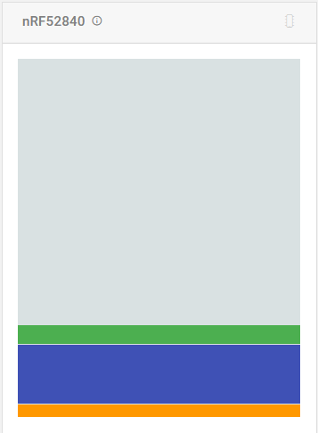
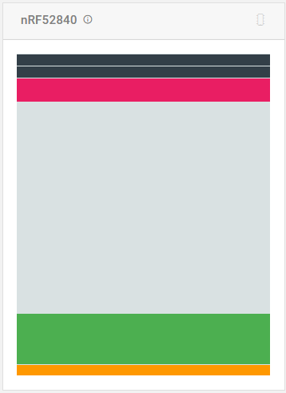
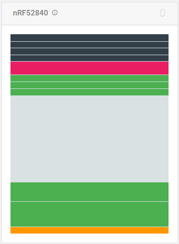
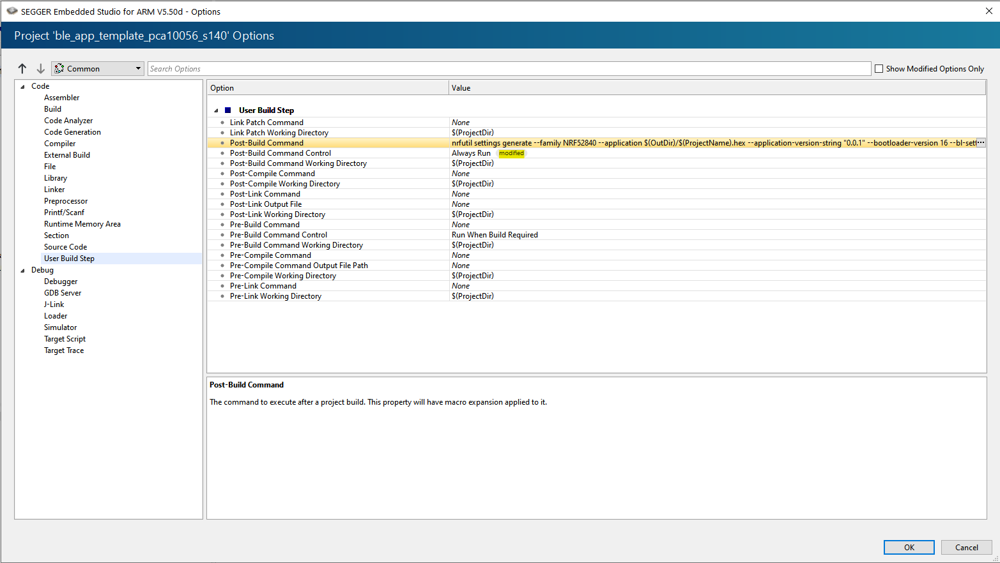
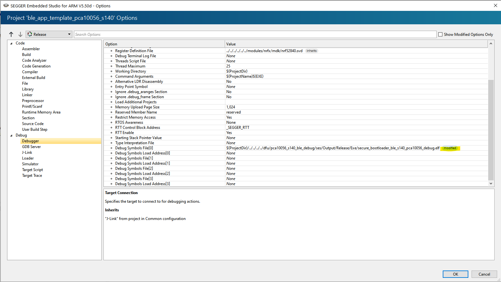
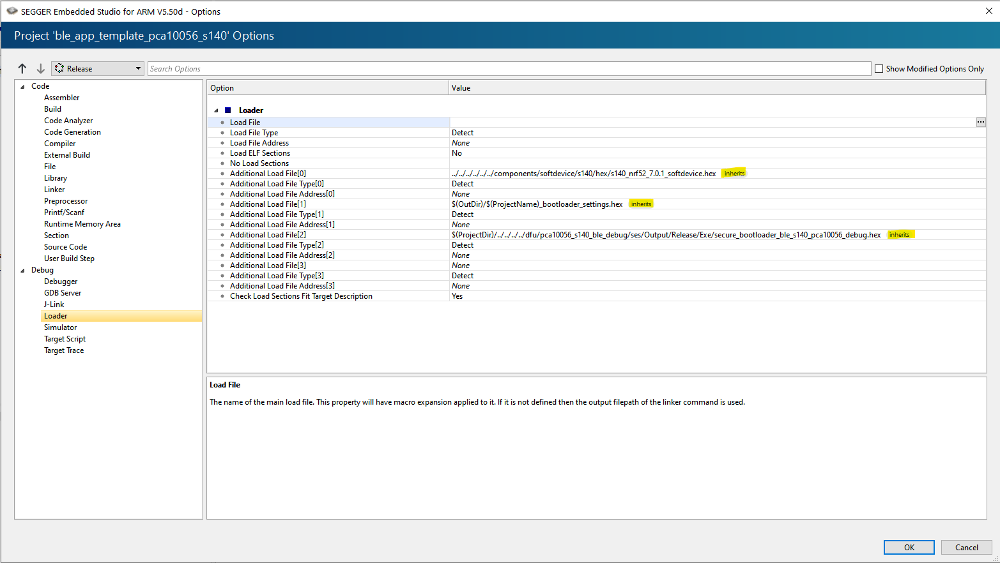

# nordic_app_dfu_playzone

## Table of Contents

- [nordic_app_dfu_playzone](#nordic_app_dfu_playzone)
  - [Table of Contents](#table-of-contents)
  - [Summary](#summary)
  - [Requirements](#requirements)
  - [Flash Memory Layout](#flash-memory-layout)
  - [Procedures](#procedures)
    - [Using Examples](#using-examples)
      - [Running App (only)](#running-app-only)
      - [running bootloader (only)](#running-bootloader-only)
        - [uploading dfu-bootloader image and performing dfu from phone](#uploading-dfu-bootloader-image-and-performing-dfu-from-phone)
    - [Building the bootloader ourselves](#building-the-bootloader-ourselves)
        - [Private and Public keys (`nrfutil keys`)](#private-and-public-keys-nrfutil-keys)
        - [flashing new bootloader](#flashing-new-bootloader)
        - [creating application update image and uploading from phone](#creating-application-update-image-and-uploading-from-phone)
          - [Generating update packages (`nrfutil pkg`)](#generating-update-packages-nrfutil-pkg)
          - [BL only](#bl-only)
          - [SD only](#sd-only)
          - [APP only](#app-only)
          - [BL + SD](#bl--sd)
          - [SD + APP](#sd--app)
          - [BL + SD + APP](#bl--sd--app)
          - [using the wrong key](#using-the-wrong-key)
    - [Flashing bootloader and application at the same time](#flashing-bootloader-and-application-at-the-same-time)
      - [Generating bootloader settings file](#generating-bootloader-settings-file)
        - [uploading all together](#uploading-all-together)
        - [Using wrong bootloader settings version](#using-wrong-bootloader-settings-version)
        - [Not uploading settings file](#not-uploading-settings-file)
      - [entering DFU start from app](#entering-dfu-start-from-app)
        - [Using the buttonless example](#using-the-buttonless-example)
          - [comparing dfu'd program vs flashed program](#comparing-dfud-program-vs-flashed-program)
        - [Using minimal template app](#using-minimal-template-app)
      - [Debugging multiple embedded projects at the same time](#debugging-multiple-embedded-projects-at-the-same-time)
    - [Advanced Post-Build](#advanced-post-build)
      - [DFU packaging](#dfu-packaging)
        - [assigning secret key path paramater](#assigning-secret-key-path-paramater)
        - [autogenerating debug versioning labels](#autogenerating-debug-versioning-labels)
          - [semantic versioning?](#semantic-versioning)
  - [References](#references)
    - [Documentation regarding nordic's DFU](#documentation-regarding-nordics-dfu)

## Summary

from the root folder of this repo run(where this README.md is located):

```ps1
git clone https://github.com/YoraiLevi/nordic_app_dfu_playzone.git
SDK_SYMLINK.ps1 "PathToSDK\nRF5SDK160098a08e2"
nrfutil keys generate private.pem
nrfutil keys display --key pk --format code private.pem > dfu_public_key.c
```

build ble_app_template!!!

```
explorer ble_app_template\pca10056\s140\ses\Output\Release\Exe
```

## Requirements

1)
  ```
   git clone https://github.com/YoraiLevi/nordic_app_dfu_playzone.git
  ```

2) [SDK v16.0.0](https://www.nordicsemi.com/Products/Development-software/nRF5-SDK/Download#infotabs)
   * run `SDK_SYMLINK.ps1 "PathToSDK"`  
   the examples require the sdk to be located under SDK in the root of this repo's folder (where README.md is located)

3) Python (Tested on 3.6.2 and 3.7.?; doesn't work on 3.9)
   * install with [chocolatey](https://chocolatey.org/install#:~:text=now%20run%20the%20following%20command%3A) (requires admin)  

   ```
   choco install python --version 3.6.2
   ```

   * install from [Python.org](https://www.python.org/downloads/#:~:text=download%20python)
   * upgrade pip for installing packages from pypi(`recommended`, **not as admin**):  

   ```
   py -3.6 -m pip install --upgrade pip
   ```

4) nrfutil globally (**don't** install python packages **as admin**)  

   ```
   py -3.6 -m pip install nrfutil
   ```

5) [nRF Command Line Tools](https://www.nordicsemi.com/Products/Development-tools/nRF-Command-Line-Tools/Download#infotabs)
6) [Embedded Studio for ARM](https://www.segger.com/downloads/embedded-studio/#ESforARM)
<!-- 7) [nRF connect](https://www.nordicsemi.com/Products/Development-tools/nRF-Connect-for-desktop) -->

## Flash Memory Layout

needs further investigation:

1) flash_placement.xml
2) #include "nrf_bootloader_info.h",BOOTLOADER_DFU_START

## Procedures

### Using Examples

#### Running App (only)

```
nrfjprog -f nrf52 --program SDK\examples\peripheral\blinky\hex\blinky_pca10056_mbr.hex --recover --verify --reset
```

```
nrfjprog -e
nrfjprog -f nrf52 --program SDK\components\softdevice\s140\hex\s140_nrf52_7.0.1_softdevice.hex --verify
nrfjprog -f nrf52 --program SDK\examples\ble_peripheral\ble_app_blinky\hex\ble_app_blinky_pca10056_s140.hex --verify
nrfjprog --reset

```

* with RTT debugging enabled: `#define NRF_LOG_BACKEND_RTT_ENABLED 1`

```
nrfjprog -e
nrfjprog -f nrf52 --program SDK\components\softdevice\s140\hex\s140_nrf52_7.0.1_softdevice.hex --verify
nrfjprog -f nrf52 --program ble_app_blinky\pca10056\s140\ses\Output\Release\Exe\ble_app_blinky_pca10056_s140.hex --verify
nrfjprog --reset

```



<details>
<summary>logging output</summary>

```
00> <info> app_timer: RTC: initialized.
00> 
00> <info> app: Blinky example started.
00> 
```

</details>

#### running bootloader (only)

```
nrfjprog -e
nrfjprog -f nrf52 --program SDK\examples\dfu\secure_bootloader\pca10056_s140_ble_debug\hex\secure_bootloader_ble_s140_pca10056_debug.hex --verify
nrfjprog --reset

```

<details>
<summary>logging output</summary>

```
00> <info> app: Inside main
00> 
00> <debug> app: In nrf_bootloader_init
00> 
00> <debug> nrf_dfu_settings: Calling nrf_dfu_settings_init()...
00> 
00> <debug> nrf_dfu_flash: Initializing nrf_fstorage_nvmc backend.
00> 
00> <debug> nrf_dfu_settings: Using settings page.
00> 
00> <debug> nrf_dfu_settings: Copying forbidden parts from backup page.
00> 
00> <debug> nrf_dfu_settings: Destination settings are identical to source, write not needed. Skipping.
00> 
00> <info> nrf_dfu_settings: Backing up settings page to address 0xFE000.
00> 
00> <debug> nrf_dfu_settings: Destination settings are identical to source, write not needed. Skipping.
00> 
00> <debug> app: Enter nrf_bootloader_fw_activate
00> 
00> <info> app: No firmware to activate.
00> 
00> <info> app: Boot validation failed. No valid app to boot.
00> 
00> <debug> app: DFU mode because app is not valid.
00> 
00> <info> nrf_bootloader_wdt: WDT is not enabled
00> 
00> <debug> app: in weak nrf_dfu_init_user
00> 
00> <debug> app: timer_stop (0x20005984)
00> 
00> <debug> app: timer_activate (0x20005984)
00> 
00> <info> app: Entering DFU mode.
00> 
00> <debug> app: Initializing transports (found: 1)
00> 
00> <debug> nrf_dfu_ble: Initializing BLE DFU transport
00> 
00> <debug> nrf_dfu_ble: Setting up vector table: 0x000F1000
00> 
00> <debug> nrf_dfu_ble: Enabling SoftDevice.
00> 
00> <debug> nrf_dfu_ble: Configuring BLE stack.
00> 
00> <debug> nrf_dfu_ble: Enabling the BLE stack.
00> 
00> <debug> nrf_dfu_ble: No advertising name found
00> 
00> <debug> nrf_dfu_ble: Using default advertising name
00> 
00> <debug> nrf_dfu_ble: Advertising...
00> 
00> <debug> nrf_dfu_ble: BLE DFU transport initialized.
00> 
00> <debug> nrf_dfu_flash: Initializing nrf_fstorage_sd backend.
00> 
00> <debug> app: Enter main loop
00> 

```

</details>



##### uploading dfu-bootloader image and performing dfu from phone

using [nRF Toolbox for Bluetooth LE](https://play.google.com/store/apps/details?id=no.nordicsemi.android.nrftoolbox&hl=en)'s DFU upload `SDK\examples\dfu\secure_dfu_test_images\ble\nrf52840\hrs_application_s140.zip`

<details>
<summary>logging output</summary>

* note : the application does not output debug info for some reason.

```
00> <info> app: Inside main
00>
00> <debug> app: In nrf_bootloader_init
00>
00> <debug> nrf_dfu_settings: Calling nrf_dfu_settings_init()...
00>
00> <debug> nrf_dfu_flash: Initializing nrf_fstorage_nvmc backend.
00>
00> <debug> nrf_dfu_settings: Using settings page.
00>
00> <debug> nrf_dfu_settings: Copying forbidden parts from backup page.
00>
00> <debug> nrf_dfu_settings: Destination settings are identical to source, write not needed. Skipping.
00>
00> <info> nrf_dfu_settings: Backing up settings page to address 0xFE000.
00>
00> <debug> nrf_dfu_settings: Destination settings are identical to source, write not needed. Skipping.
00>
00> <debug> app: Enter nrf_bootloader_fw_activate
00>
00> <info> app: No firmware to activate.
00>
00> <debug> app: App is valid
00>
00> <info> nrf_dfu_settings: Backing up settings page to address 0xFE000.
00>
00> <debug> nrf_dfu_settings: Destination settings are identical to source, write not needed. Skipping.
00>
00> <debug> app: Running nrf_bootloader_app_start with address: 0x00001000
00>
00> <debug> app: Disabling interrupts. NVIC->ICER[0]: 0x0
00>

```

</details>



### Building the bootloader ourselves

generate a private and public key and build the dfu-bootloader debug example

##### Private and Public keys (`nrfutil keys`)

private key

```
nrfutil keys generate private.pem
```

public key for debug bootloader

```
nrfutil keys display --key pk --format dbgcode private.pem > dfu_public_key.c
```

public key for non-debug bootloader

```
nrfutil keys display --key pk --format code private.pem > dfu_public_key.c
```

##### flashing new bootloader

```
nrfjprog -e
nrfjprog -f nrf52 --program SDK\components\softdevice\s140\hex\s140_nrf52_7.0.1_softdevice.hex --verify
nrfjprog -f nrf52 --program dfu\pca10056_s140_ble_debug\ses\Output\Release\Exe\secure_bootloader_ble_s140_pca10056_debug.hex --verify
nrfjprog --reset

```

<details>
<summary>
logging output
</summary>

```
00> <info> app: Inside main
00> 
00> <debug> app: In nrf_bootloader_init
00> 
00> <debug> nrf_dfu_settings: Calling nrf_dfu_settings_init()...
00> 
00> <debug> nrf_dfu_flash: Initializing nrf_fstorage_nvmc backend.
00> 
00> <debug> nrf_dfu_settings: Using settings page.
00> 
00> <debug> nrf_dfu_settings: Copying forbidden parts from backup page.
00> 
00> <debug> nrf_dfu_settings: Destination settings are identical to source, write not needed. Skipping.
00> 
00> <info> nrf_dfu_settings: Backing up settings page to address 0xFE000.
00> 
00> <debug> nrf_dfu_settings: Destination settings are identical to source, write not needed. Skipping.
00> 
00> <debug> app: Enter nrf_bootloader_fw_activate
00> 
00> <info> app: No firmware to activate.
00> 
00> <info> app: Boot validation failed. No valid app to boot.
00> 
00> <debug> app: DFU mode because app is not valid.
00> 
00> <info> nrf_bootloader_wdt: WDT is not enabled
00> 
00> <debug> app: in weak nrf_dfu_init_user
00> 
00> <debug> app: timer_stop (0x20005984)
00> 
00> <debug> app: timer_activate (0x20005984)
00> 
00> <info> app: Entering DFU mode.
00> 
00> <debug> app: Initializing transports (found: 1)
00> 
00> <debug> nrf_dfu_ble: Initializing BLE DFU transport
00> 
00> <debug> nrf_dfu_ble: Setting up vector table: 0x000F1000
00> 
00> <debug> nrf_dfu_ble: Enabling SoftDevice.
00> 
00> <debug> nrf_dfu_ble: Configuring BLE stack.
00> 
00> <debug> nrf_dfu_ble: Enabling the BLE stack.
00> 
00> <debug> nrf_dfu_ble: No advertising name found
00> 
00> <debug> nrf_dfu_ble: Using default advertising name
00> 
00> <debug> nrf_dfu_ble: Advertising...
00> 
00> <debug> nrf_dfu_ble: BLE DFU transport initialized.
00> 
00> <debug> nrf_dfu_flash: Initializing nrf_fstorage_sd backend.
00> 
00> <debug> app: Enter main loop
00> 
```

</details>

##### creating application update image and uploading from phone

###### Generating update packages (`nrfutil pkg`)

 The following combinations are supported (12/07/2021):  
| 1 item                                          | 2 items                                              | 3 items                    |
| ----------------------------------------------- | ---------------------------------------------------- | -------------------------- |
| BL only: Supported✅.                            | BL + SD: Supported✅.                                 | BL + SD + APP: Supported✅. |
| SD only: Supported✅ (SD of same Major Version). | BL + APP: Not Supported❌ (use two packages instead). |
| APP only: Supported✅ (external or internal).    | SD + APP: Supported✅ (SD of same Major Version)      |

###### BL only

###### SD only

###### APP only

```
nrfutil pkg generate --key-file private.pem --hw-version 52 --debug-mode --application ble_app_blinky\pca10056\s140\ses\Output\Release\Exe\ble_app_blinky_pca10056_s140.hex --application-version-string "0.0.1" APP_package.zip

```

###### BL + SD

###### SD + APP

###### BL + SD + APP

to see the full logging info require reconnection of the RTT viewer.
<details>
<summary>
logging info stage 1
</summary>

```
00> <info> app: Inside main
00> 
00> <debug> app: In nrf_bootloader_init
00> 
00> <debug> nrf_dfu_settings: Calling nrf_dfu_settings_init()...
00> 
00> <debug> nrf_dfu_flash: Initializing nrf_fstorage_nvmc backend.
00> 
00> <debug> nrf_dfu_settings: Using settings page.
00> 
00> <debug> nrf_dfu_settings: Copying forbidden parts from backup page.
00> 
00> <debug> nrf_dfu_settings: Destination settings are identical to source, write not needed. Skipping.
00> 
00> <info> nrf_dfu_settings: Backing up settings page to address 0xFE000.
00> 
00> <debug> nrf_dfu_settings: Destination settings are identical to source, write not needed. Skipping.
00> 
00> <debug> app: Enter nrf_bootloader_fw_activate
00> 
00> <info> app: No firmware to activate.
00> 
00> <info> app: Boot validation failed. No valid app to boot.
00> 
00> <debug> app: DFU mode because app is not valid.
00> 
00> <info> nrf_bootloader_wdt: WDT is not enabled
00> 
00> <debug> app: in weak nrf_dfu_init_user
00> 
00> <debug> app: timer_stop (0x20005984)
00> 
00> <debug> app: timer_activate (0x20005984)
00> 
00> <info> app: Entering DFU mode.
00> 
00> <debug> app: Initializing transports (found: 1)
00> 
00> <debug> nrf_dfu_ble: Initializing BLE DFU transport
00> 
00> <debug> nrf_dfu_ble: Setting up vector table: 0x000F1000
00> 
00> <debug> nrf_dfu_ble: Enabling SoftDevice.
00> 
00> <debug> nrf_dfu_ble: Configuring BLE stack.
00> 
00> <debug> nrf_dfu_ble: Enabling the BLE stack.
00> 
00> <debug> nrf_dfu_ble: No advertising name found
00> 
00> <debug> nrf_dfu_ble: Using default advertising name
00> 
00> <debug> nrf_dfu_ble: Advertising...
00> 
00> <debug> nrf_dfu_ble: BLE DFU transport initialized.
00> 
00> <debug> nrf_dfu_flash: Initializing nrf_fstorage_sd backend.
00> 
00> <debug> app: Enter main loop
00> 
00> <debug> nrf_dfu_ble: Connected
00> 
00> <debug> nrf_dfu_ble: Received BLE_GAP_EVT_CONN_PARAM_UPDATE
00> 
00> <debug> nrf_dfu_ble: max_conn_interval: 12
00> 
00> <debug> nrf_dfu_ble: min_conn_interval: 12
00> 
00> <debug> nrf_dfu_ble: slave_latency: 0
00> 
00> <debug> nrf_dfu_ble: conn_sup_timeout: 600
00> 
00> <debug> nrf_dfu_ble: Received BLE_GAP_EVT_CONN_PARAM_UPDATE
00> 
00> <debug> nrf_dfu_ble: max_conn_interval: 6
00> 
00> <debug> nrf_dfu_ble: min_conn_interval: 6
00> 
00> <debug> nrf_dfu_ble: slave_latency: 0
00> 
00> <debug> nrf_dfu_ble: conn_sup_timeout: 500
00> 
00> <debug> nrf_dfu_ble: Received BLE_GAP_EVT_CONN_PARAM_UPDATE
00> 
00> <debug> nrf_dfu_ble: max_conn_interval: 12
00> 
00> <debug> nrf_dfu_ble: min_conn_interval: 12
00> 
00> <debug> nrf_dfu_ble: slave_latency: 0
00> 
00> <debug> nrf_dfu_ble: conn_sup_timeout: 600
00> 
00> <debug> nrf_dfu_ble: Received BLE_GATTS_EVT_EXCHANGE_MTU_REQUEST (request: 517, reply: 247).
00> 
00> <debug> nrf_dfu_ble: Received BLE_GAP_EVT_DATA_LENGTH_UPDATE_REQUEST.
00> 
00> <debug> nrf_dfu_ble: Received BLE_GAP_EVT_DATA_LENGTH_UPDATE (251, max_rx_time 2120).
00> 
00> <debug> nrf_dfu_req_handler: Handle NRF_DFU_OP_OBJECT_SELECT (command)
00> 
00> <debug> nrf_dfu_req_handler: Request handling complete. Result: 0x1
00> 
00> <debug> nrf_dfu_ble: Set receipt notif
00> 
00> <debug> nrf_dfu_req_handler: Handle NRF_DFU_OP_RECEIPT_NOTIF_SET
00> 
00> <debug> nrf_dfu_req_handler: Request handling complete. Result: 0x1
00> 
00> <debug> app: Shutting down transports (found: 1)
00> 
00> <debug> nrf_dfu_req_handler: Handle NRF_DFU_OP_OBJECT_CREATE (command)
00> 
00> <debug> app: timer_stop (0x20005984)
00> 
00> <debug> app: timer_activate (0x20005984)
00> 
00> <debug> nrf_dfu_req_handler: Request handling complete. Result: 0x1
00> 
00> <debug> nrf_dfu_ble: Buffer 0x200092BC acquired, len 142 (244)
00> 
00> <debug> nrf_dfu_req_handler: Handle NRF_DFU_OP_OBJECT_WRITE (command)
00> 
00> <debug> nrf_dfu_ble: Freeing buffer 0x200092BC
00> 
00> <debug> nrf_dfu_req_handler: Request handling complete. Result: 0x1
00> 
00> <debug> nrf_dfu_req_handler: Handle NRF_DFU_OP_CRC_GET (command)
00> 
00> <debug> nrf_dfu_req_handler: Request handling complete. Result: 0x1
00> 
00> <debug> nrf_dfu_req_handler: Handle NRF_DFU_OP_OBJECT_EXECUTE (command)
00> 
00> <debug> nrf_dfu_validation: PB: Init packet data len: 65
00> 
00> <info> nrf_dfu_validation: Signature required. Checking signature.
00> 
00> <info> nrf_dfu_validation: Calculating hash (len: 65)
00> 
00> <info> nrf_dfu_validation: Verify signature
00> 
00> <info> nrf_dfu_validation: Image verified
00> 
00> <debug> app: Enter nrf_dfu_cache_prepare()
00> 
00> <debug> app: required_size: 0x5DC8.
00> 
00> <debug> app: single_bank: false.
00> 
00> <debug> app: keep_app: false.
00> 
00> <debug> app: keep_softdevice: true.
00> 
00> <debug> app: SD_PRESENT: true.
00> 
00> <debug> app: Bank contents:
00> 
00> <debug> app: Bank 0 code: 0x00: Size: 0x0
00> 
00> <debug> app: Bank 1 code: 0x00: Size: 0x0
00> 
00> <debug> app: pass: 0.
00> 
00> <debug> app: cache_address: 0x27000.
00> 
00> <debug> app: cache_too_small: false.
00> 
00> <debug> app: keep_firmware: false.
00> 
00> <debug> app: delete_more: false.
00> 
00> <debug> nrf_dfu_validation: Write address set to 0x00027000
00> 
00> <debug> nrf_dfu_settings: Writing settings...
00> 
00> <debug> nrf_dfu_settings: Erasing old settings at: 0x000FF000
00> 
00> <debug> nrf_dfu_flash: nrf_fstorage_erase(addr=0x0x000FF000, len=1 pages), queue usage: 0
00> 
00> <debug> nrf_dfu_flash: nrf_fstorage_write(addr=0x000FF000, src=0x2000A6D8, len=896 bytes), queue usage: 1
00> 
00> <info> nrf_dfu_settings: Backing up settings page to address 0xFE000.
00> 
00> <debug> nrf_dfu_settings: Writing settings...
00> 
00> <debug> nrf_dfu_settings: Erasing old settings at: 0x000FE000
00> 
00> <debug> nrf_dfu_flash: nrf_fstorage_erase(addr=0x0x000FE000, len=1 pages), queue usage: 2
00> 
00> <debug> nrf_dfu_flash: nrf_fstorage_write(addr=0x000FE000, src=0x2000A358, len=896 bytes), queue usage: 3
00> 
00> <debug> nrf_dfu_req_handler: Writing valid init command to flash.
00> 
00> <debug> nrf_dfu_req_handler: Request handling complete. Result: 0x1
00> 
00> <debug> nrf_dfu_req_handler: Handle NRF_DFU_OP_OBJECT_SELECT (data)
00> 
00> <debug> nrf_dfu_req_handler: crc = 0x0, offset = 0x0, max_size = 0x1000
00> 
00> <debug> nrf_dfu_req_handler: Request handling complete. Result: 0x1
00> 
00> <debug> nrf_dfu_flash: Flash erase success: addr=0x000FF000, pending 3
00> 
00> <debug> nrf_dfu_req_handler: Handle NRF_DFU_OP_OBJECT_CREATE (data)
00> 
00> <debug> nrf_dfu_flash: nrf_fstorage_erase(addr=0x0x00027000, len=1 pages), queue usage: 3
00> 
00> <debug> nrf_dfu_req_handler: Creating object with size: 4096. Offset: 0x00000000, CRC: 0x00000000
00> 
00> <debug> nrf_dfu_req_handler: Request handling complete. Result: 0x1
00> 
00> <debug> nrf_dfu_flash: Flash write success: addr=0x000FF000, pending 3
00> 
00> <debug> nrf_dfu_flash: Flash erase success: addr=0x000FE000, pending 2
00> 
00> <debug> nrf_dfu_flash: Flash write success: addr=0x000FE000, pending 1
00> 
00> <debug> nrf_dfu_flash: Flash erase success: addr=0x00027000, pending 0
00> 
00> <debug> nrf_dfu_ble: Buffer 0x200092BC acquired, len 244 (244)
00> 
00> <debug> nrf_dfu_req_handler: Handle NRF_DFU_OP_OBJECT_WRITE (data)
00> 
00> <debug> nrf_dfu_flash: nrf_fstorage_write(addr=0x00027000, src=0x200092BC, len=244 bytes), queue usage: 0
00> 
00> <debug> nrf_dfu_req_handler: Request handling complete. Result: 0x1
00> 
00> <debug> nrf_dfu_flash: Flash write success: addr=0x00027000, pending 0
00> 
00> <debug> nrf_dfu_ble: Freeing buffer 0x200092BC
00> 
00> <debug> nrf_dfu_ble: Buffer 0x200092BC acquired, len 244 (244)
00> 
00> <debug> nrf_dfu_req_handler: Handle NRF_DFU_OP_OBJECT_WRITE (data)
00> 
00> <debug> nrf_dfu_flash: nrf_fstorage_write(addr=0x000270F4, src=0x200092BC, len=244 bytes), queue usage: 0
00> 
00> <debug> nrf_dfu_req_handler: Request handling complete. Result: 0x1
00> 
00> <debug> nrf_dfu_flash: Flash write success: addr=0x000270F4, pending 0
00> 
00> <debug> nrf_dfu_ble: Freeing buffer 0x200092BC
00> 
00> <debug> nrf_dfu_ble: Buffer 0x200092BC acquired, len 244 (244)
00> 
00> <debug> nrf_dfu_req_handler: Handle NRF_DFU_OP_OBJECT_WRITE (data)
00> 
00> <debug> nrf_dfu_flash: nrf_fstorage_write(addr=0x000271E8, src=0x200092BC, len=244 bytes), queue usage: 0
00> 
00> <debug> nrf_dfu_req_handler: Request handling complete. Result: 0x1
00> 
00> <debug> nrf_dfu_flash: Flash write success: addr=0x000271E8, pending 0
00> 
00> <debug> nrf_dfu_ble: Freeing buffer 0x200092BC
00> 
00> <debug> nrf_dfu_ble: Buffer 0x200092BC acquired, len 244 (244)
00> 
00> <debug> nrf_dfu_req_handler: Handle NRF_DFU_OP_OBJECT_WRITE (data)
00> 
00> <debug> nrf_dfu_flash: nrf_fstorage_write(addr=0x000272DC, src=0x200092BC, len=244 bytes), queue usage: 0
00> 
00> <debug> nrf_dfu_req_handler: Request handling complete. Result: 0x1
00> 
00> <debug> nrf_dfu_flash: Flash write success: addr=0x000272DC, pending 0
00> 
00> <debug> nrf_dfu_ble: Freeing buffer 0x200092BC
00> 
00> <debug> nrf_dfu_ble: Buffer 0x200092BC acquired, len 244 (244)
00> 
00> <debug> nrf_dfu_req_handler: Handle NRF_DFU_OP_OBJECT_WRITE (data)
00> 
00> <debug> nrf_dfu_flash: nrf_fstorage_write(addr=0x000273D0, src=0x200092BC, len=244 bytes), queue usage: 0
00> 
00> <debug> nrf_dfu_req_handler: Request handling complete. Result: 0x1
00> 
00> <debug> nrf_dfu_flash: Flash write success: addr=0x000273D0, pending 0
00> 
00> <debug> nrf_dfu_ble: Freeing buffer 0x200092BC
00> 
00> <debug> nrf_dfu_ble: Buffer 0x200092BC acquired, len 244 (244)
00> 
00> <debug> nrf_dfu_req_handler: Handle NRF_DFU_OP_OBJECT_WRITE (data)
00> 
00> <debug> nrf_dfu_flash: nrf_fstorage_write(addr=0x000274C4, src=0x200092BC, len=244 bytes), queue usage: 0
00> 
00> <debug> nrf_dfu_req_handler: Request handling complete. Result: 0x1
00> 
00> <debug> nrf_dfu_flash: Flash write success: addr=0x000274C4, pending 0
00> 
00> <debug> nrf_dfu_ble: Freeing buffer 0x200092BC
00> 
00> <debug> nrf_dfu_ble: Buffer 0x200092BC acquired, len 244 (244)
00> 
00> <debug> nrf_dfu_req_handler: Handle NRF_DFU_OP_OBJECT_WRITE (data)
00> 
00> <debug> nrf_dfu_flash: nrf_fstorage_write(addr=0x000275B8, src=0x200092BC, len=244 bytes), queue usage: 0
00> 
00> <debug> nrf_dfu_req_handler: Request handling complete. Result: 0x1
00> 
00> <debug> nrf_dfu_flash: Flash write success: addr=0x000275B8, pending 0
00> 
00> <debug> nrf_dfu_ble: Freeing buffer 0x200092BC
00> 
00> <debug> nrf_dfu_ble: Buffer 0x200092BC acquired, len 244 (244)
00> 
00> <debug> nrf_dfu_req_handler: Handle NRF_DFU_OP_OBJECT_WRITE (data)
00> 
00> <debug> nrf_dfu_flash: nrf_fstorage_write(addr=0x000276AC, src=0x200092BC, len=244 bytes), queue usage: 0
00> 
00> <debug> nrf_dfu_req_handler: Request handling complete. Result: 0x1
00> 
00> <debug> nrf_dfu_flash: Flash write success: addr=0x000276AC, pending 0
00> 
00> <debug> nrf_dfu_ble: Freeing buffer 0x200092BC
00> 
00> <debug> nrf_dfu_ble: Buffer 0x200092BC acquired, len 244 (244)
00> 
00> <debug> nrf_dfu_req_handler: Handle NRF_DFU_OP_OBJECT_WRITE (data)
00> 
00> <debug> nrf_dfu_flash: nrf_fstorage_write(addr=0x000277A0, src=0x200092BC, len=244 bytes), queue usage: 0
00> 
00> <debug> nrf_dfu_req_handler: Request handling complete. Result: 0x1
00> 
00> <debug> nrf_dfu_flash: Flash write success: addr=0x000277A0, pending 0
00> 
00> <debug> nrf_dfu_ble: Freeing buffer 0x200092BC
00> 
00> <debug> nrf_dfu_ble: Buffer 0x200092BC acquired, len 244 (244)
00> 
00> <debug> nrf_dfu_req_handler: Handle NRF_DFU_OP_OBJECT_WRITE (data)
00> 
00> <debug> nrf_dfu_flash: nrf_fstorage_write(addr=0x00027894, src=0x200092BC, len=244 bytes), queue usage: 0
00> 
00> <debug> nrf_dfu_req_handler: Request handling complete. Result: 0x1
00> 
00> <debug> nrf_dfu_flash: Flash write success: addr=0x00027894, pending 0
00> 
00> <debug> nrf_dfu_ble: Freeing buffer 0x200092BC
00> 
00> <debug> nrf_dfu_ble: Buffer 0x200092BC acquired, len 244 (244)
00> 
00> <debug> nrf_dfu_req_handler: Handle NRF_DFU_OP_OBJECT_WRITE (data)
00> 
00> <debug> nrf_dfu_flash: nrf_fstorage_write(addr=0x00027988, src=0x200092BC, len=244 bytes), queue usage: 0
00> 
00> <debug> nrf_dfu_req_handler: Request handling complete. Result: 0x1
00> 
00> <debug> nrf_dfu_flash: Flash write success: addr=0x00027988, pending 0
00> 
00> <debug> nrf_dfu_ble: Freeing buffer 0x200092BC
00> 
00> <debug> nrf_dfu_ble: Buffer 0x200092BC acquired, len 244 (244)
00> 
00> <debug> nrf_dfu_req_handler: Handle NRF_DFU_OP_OBJECT_WRITE (data)
00> 
00> <debug> nrf_dfu_flash: nrf_fstorage_write(addr=0x00027A7C, src=0x200092BC, len=244 bytes), queue usage: 0
00> 
00> <debug> nrf_dfu_req_handler: Request handling complete. Result: 0x1
00> 
00> <debug> nrf_dfu_flash: Flash write success: addr=0x00027A7C, pending 0
00> 
00> <debug> nrf_dfu_ble: Freeing buffer 0x200092BC
00> 
00> <debug> nrf_dfu_ble: Buffer 0x200092BC acquired, len 244 (244)
00> 
00> <debug> nrf_dfu_req_handler: Handle NRF_DFU_OP_OBJECT_WRITE (data)
00> 
00> <debug> nrf_dfu_flash: nrf_fstorage_write(addr=0x00027B70, src=0x200092BC, len=244 bytes), queue usage: 0
00> 
00> <debug> nrf_dfu_req_handler: Request handling complete. Result: 0x1
00> 
00> <debug> nrf_dfu_flash: Flash write success: addr=0x00027B70, pending 0
00> 
00> <debug> nrf_dfu_ble: Freeing buffer 0x200092BC
00> 
00> <debug> nrf_dfu_ble: Buffer 0x200092BC acquired, len 244 (244)
00> 
00> <debug> nrf_dfu_req_handler: Handle NRF_DFU_OP_OBJECT_WRITE (data)
00> 
00> <debug> nrf_dfu_flash: nrf_fstorage_write(addr=0x00027C64, src=0x200092BC, len=244 bytes), queue usage: 0
00> 
00> <debug> nrf_dfu_req_handler: Request handling complete. Result: 0x1
00> 
00> <debug> nrf_dfu_flash: Flash write success: addr=0x00027C64, pending 0
00> 
00> <debug> nrf_dfu_ble: Freeing buffer 0x200092BC
00> 
00> <debug> nrf_dfu_ble: Buffer 0x200092BC acquired, len 244 (244)
00> 
00> <debug> nrf_dfu_req_handler: Handle NRF_DFU_OP_OBJECT_WRITE (data)
00> 
00> <debug> nrf_dfu_flash: nrf_fstorage_write(addr=0x00027D58, src=0x200092BC, len=244 bytes), queue usage: 0
00> 
00> <debug> nrf_dfu_req_handler: Request handling complete. Result: 0x1
00> 
00> <debug> nrf_dfu_flash: Flash write success: addr=0x00027D58, pending 0
00> 
00> <debug> nrf_dfu_ble: Freeing buffer 0x200092BC
00> 
00> <debug> nrf_dfu_ble: Buffer 0x200092BC acquired, len 244 (244)
00> 
00> <debug> nrf_dfu_req_handler: Handle NRF_DFU_OP_OBJECT_WRITE (data)
00> 
00> <debug> nrf_dfu_flash: nrf_fstorage_write(addr=0x00027E4C, src=0x200092BC, len=244 bytes), queue usage: 0
00> 
00> <debug> nrf_dfu_req_handler: Request handling complete. Result: 0x1
00> 
00> <debug> nrf_dfu_flash: Flash write success: addr=0x00027E4C, pending 0
00> 
00> <debug> nrf_dfu_ble: Freeing buffer 0x200092BC
00> 
00> <debug> nrf_dfu_ble: Buffer 0x200092BC acquired, len 192 (244)
00> 
00> <debug> nrf_dfu_req_handler: Handle NRF_DFU_OP_OBJECT_WRITE (data)
00> 
00> <debug> nrf_dfu_flash: nrf_fstorage_write(addr=0x00027F40, src=0x200092BC, len=192 bytes), queue usage: 0
00> 
00> <debug> nrf_dfu_req_handler: Request handling complete. Result: 0x1
00> 
00> <debug> nrf_dfu_req_handler: Handle NRF_DFU_OP_CRC_GET (data)
00> 
00> <debug> nrf_dfu_req_handler: Offset:4096, CRC:0x58802FA0
00> 
00> <debug> nrf_dfu_req_handler: Request handling complete. Result: 0x1
00> 
00> <debug> nrf_dfu_flash: Flash write success: addr=0x00027F40, pending 0
00> 
00> <debug> nrf_dfu_ble: Freeing buffer 0x200092BC
00> 
00> <debug> nrf_dfu_req_handler: Handle NRF_DFU_OP_OBJECT_EXECUTE (data)
00> 
00> <debug> nrf_dfu_req_handler: Request handling complete. Result: 0x1
00> 
00> <debug> app: timer_stop (0x20005984)
00> 
00> <debug> app: timer_activate (0x20005984)
00> 
00> <debug> nrf_dfu_req_handler: Handle NRF_DFU_OP_OBJECT_CREATE (data)
00> 
00> <debug> nrf_dfu_flash: nrf_fstorage_erase(addr=0x0x00028000, len=1 pages), queue usage: 0
00> 
00> <debug> nrf_dfu_req_handler: Creating object with size: 4096. Offset: 0x00001000, CRC: 0x58802FA0
00> 
00> <debug> nrf_dfu_req_handler: Request handling complete. Result: 0x1
00> 
00> <debug> nrf_dfu_flash: Flash erase success: addr=0x00028000, pending 0
00> 
00> <debug> nrf_dfu_ble: Buffer 0x200092BC acquired, len 244 (244)
00> 
00> <debug> nrf_dfu_req_handler: Handle NRF_DFU_OP_OBJECT_WRITE (data)
00> 
00> <debug> nrf_dfu_flash: nrf_fstorage_write(addr=0x00028000, src=0x200092BC, len=244 bytes), queue usage: 0
00> 
00> <debug> nrf_dfu_req_handler: Request handling complete. Result: 0x1
00> 
00> <debug> nrf_dfu_flash: Flash write success: addr=0x00028000, pending 0
00> 
00> <debug> nrf_dfu_ble: Freeing buffer 0x200092BC
00> 
00> <debug> nrf_dfu_ble: Buffer 0x200092BC acquired, len 244 (244)
00> 
00> <debug> nrf_dfu_req_handler: Handle NRF_DFU_OP_OBJECT_WRITE (data)
00> 
00> <debug> nrf_dfu_flash: nrf_fstorage_write(addr=0x000280F4, src=0x200092BC, len=244 bytes), queue usage: 0
00> 
00> <debug> nrf_dfu_req_handler: Request handling complete. Result: 0x1
00> 
00> <debug> nrf_dfu_flash: Flash write success: addr=0x000280F4, pending 0
00> 
00> <debug> nrf_dfu_ble: Freeing buffer 0x200092BC
00> 
00> <debug> nrf_dfu_ble: Buffer 0x200092BC acquired, len 244 (244)
00> 
00> <debug> nrf_dfu_req_handler: Handle NRF_DFU_OP_OBJECT_WRITE (data)
00> 
00> <debug> nrf_dfu_flash: nrf_fstorage_write(addr=0x000281E8, src=0x200092BC, len=244 bytes), queue usage: 0
00> 
00> <debug> nrf_dfu_req_handler: Request handling complete. Result: 0x1
00> 
00> <debug> nrf_dfu_flash: Flash write success: addr=0x000281E8, pending 0
00> 
00> <debug> nrf_dfu_ble: Freeing buffer 0x200092BC
00> 
00> <debug> nrf_dfu_ble: Buffer 0x200092BC acquired, len 244 (244)
00> 
00> <debug> nrf_dfu_req_handler: Handle NRF_DFU_OP_OBJECT_WRITE (data)
00> 
00> <debug> nrf_dfu_flash: nrf_fstorage_write(addr=0x000282DC, src=0x200092BC, len=244 bytes), queue usage: 0
00> 
00> <debug> nrf_dfu_req_handler: Request handling complete. Result: 0x1
00> 
00> <debug> nrf_dfu_flash: Flash write success: addr=0x000282DC, pending 0
00> 
00> <debug> nrf_dfu_ble: Freeing buffer 0x200092BC
00> 
00> <debug> nrf_dfu_ble: Buffer 0x200092BC acquired, len 244 (244)
00> 
00> <debug> nrf_dfu_req_handler: Handle NRF_DFU_OP_OBJECT_WRITE (data)
00> 
00> <debug> nrf_dfu_flash: nrf_fstorage_write(addr=0x000283D0, src=0x200092BC, len=244 bytes), queue usage: 0
00> 
00> <debug> nrf_dfu_req_handler: Request handling complete. Result: 0x1
00> 
00> <debug> nrf_dfu_flash: Flash write success: addr=0x000283D0, pending 0
00> 
00> <debug> nrf_dfu_ble: Freeing buffer 0x200092BC
00> 
00> <debug> nrf_dfu_ble: Buffer 0x200092BC acquired, len 244 (244)
00> 
00> <debug> nrf_dfu_req_handler: Handle NRF_DFU_OP_OBJECT_WRITE (data)
00> 
00> <debug> nrf_dfu_flash: nrf_fstorage_write(addr=0x000284C4, src=0x200092BC, len=244 bytes), queue usage: 0
00> 
00> <debug> nrf_dfu_req_handler: Request handling complete. Result: 0x1
00> 
00> <debug> nrf_dfu_flash: Flash write success: addr=0x000284C4, pending 0
00> 
00> <debug> nrf_dfu_ble: Freeing buffer 0x200092BC
00> 
00> <debug> nrf_dfu_ble: Buffer 0x200092BC acquired, len 244 (244)
00> 
00> <debug> nrf_dfu_req_handler: Handle NRF_DFU_OP_OBJECT_WRITE (data)
00> 
00> <debug> nrf_dfu_flash: nrf_fstorage_write(addr=0x000285B8, src=0x200092BC, len=244 bytes), queue usage: 0
00> 
00> <debug> nrf_dfu_req_handler: Request handling complete. Result: 0x1
00> 
00> <debug> nrf_dfu_flash: Flash write success: addr=0x000285B8, pending 0
00> 
00> <debug> nrf_dfu_ble: Freeing buffer 0x200092BC
00> 
00> <debug> nrf_dfu_ble: Buffer 0x200092BC acquired, len 244 (244)
00> 
00> <debug> nrf_dfu_req_handler: Handle NRF_DFU_OP_OBJECT_WRITE (data)
00> 
00> <debug> nrf_dfu_flash: nrf_fstorage_write(addr=0x000286AC, src=0x200092BC, len=244 bytes), queue usage: 0
00> 
00> <debug> nrf_dfu_req_handler: Request handling complete. Result: 0x1
00> 
00> <debug> nrf_dfu_flash: Flash write success: addr=0x000286AC, pending 0
00> 
00> <debug> nrf_dfu_ble: Freeing buffer 0x200092BC
00> 
00> <debug> nrf_dfu_ble: Buffer 0x200092BC acquired, len 244 (244)
00> 
00> <debug> nrf_dfu_req_handler: Handle NRF_DFU_OP_OBJECT_WRITE (data)
00> 
00> <debug> nrf_dfu_flash: nrf_fstorage_write(addr=0x000287A0, src=0x200092BC, len=244 bytes), queue usage: 0
00> 
00> <debug> nrf_dfu_req_handler: Request handling complete. Result: 0x1
00> 
00> <debug> nrf_dfu_flash: Flash write success: addr=0x000287A0, pending 0
00> 
00> <debug> nrf_dfu_ble: Freeing buffer 0x200092BC
00> 
00> <debug> nrf_dfu_ble: Buffer 0x200092BC acquired, len 244 (244)
00> 
00> <debug> nrf_dfu_req_handler: Handle NRF_DFU_OP_OBJECT_WRITE (data)
00> 
00> <debug> nrf_dfu_flash: nrf_fstorage_write(addr=0x00028894, src=0x200092BC, len=244 bytes), queue usage: 0
00> 
00> <debug> nrf_dfu_req_handler: Request handling complete. Result: 0x1
00> 
00> <debug> nrf_dfu_flash: Flash write success: addr=0x00028894, pending 0
00> 
00> <debug> nrf_dfu_ble: Freeing buffer 0x200092BC
00> 
00> <debug> nrf_dfu_ble: Buffer 0x200092BC acquired, len 244 (244)
00> 
00> <debug> nrf_dfu_req_handler: Handle NRF_DFU_OP_OBJECT_WRITE (data)
00> 
00> <debug> nrf_dfu_flash: nrf_fstorage_write(addr=0x00028988, src=0x200092BC, len=244 bytes), queue usage: 0
00> 
00> <debug> nrf_dfu_req_handler: Request handling complete. Result: 0x1
00> 
00> <debug> nrf_dfu_flash: Flash write success: addr=0x00028988, pending 0
00> 
00> <debug> nrf_dfu_ble: Freeing buffer 0x200092BC
00> 
00> <debug> nrf_dfu_ble: Buffer 0x200092BC acquired, len 244 (244)
00> 
00> <debug> nrf_dfu_req_handler: Handle NRF_DFU_OP_OBJECT_WRITE (data)
00> 
00> <debug> nrf_dfu_flash: nrf_fstorage_write(addr=0x00028A7C, src=0x200092BC, len=244 bytes), queue usage: 0
00> 
00> <debug> nrf_dfu_req_handler: Request handling complete. Result: 0x1
00> 
00> <debug> nrf_dfu_flash: Flash write success: addr=0x00028A7C, pending 0
00> 
00> <debug> nrf_dfu_ble: Freeing buffer 0x200092BC
00> 
00> <debug> nrf_dfu_ble: Buffer 0x200092BC acquired, len 244 (244)
00> 
00> <debug> nrf_dfu_req_handler: Handle NRF_DFU_OP_OBJECT_WRITE (data)
00> 
00> <debug> nrf_dfu_flash: nrf_fstorage_write(addr=0x00028B70, src=0x200092BC, len=244 bytes), queue usage: 0
00> 
00> <debug> nrf_dfu_req_handler: Request handling complete. Result: 0x1
00> 
00> <debug> nrf_dfu_flash: Flash write success: addr=0x00028B70, pending 0
00> 
00> <debug> nrf_dfu_ble: Freeing buffer 0x200092BC
00> 
00> <debug> nrf_dfu_ble: Buffer 0x200092BC acquired, len 244 (244)
00> 
00> <debug> nrf_dfu_req_handler: Handle NRF_DFU_OP_OBJECT_WRITE (data)
00> 
00> <debug> nrf_dfu_flash: nrf_fstorage_write(addr=0x00028C64, src=0x200092BC, len=244 bytes), queue usage: 0
00> 
00> <debug> nrf_dfu_req_handler: Request handling complete. Result: 0x1
00> 
00> <debug> nrf_dfu_flash: Flash write success: addr=0x00028C64, pending 0
00> 
00> <debug> nrf_dfu_ble: Freeing buffer 0x200092BC
00> 
00> <debug> nrf_dfu_ble: Buffer 0x200092BC acquired, len 244 (244)
00> 
00> <debug> nrf_dfu_req_handler: Handle NRF_DFU_OP_OBJECT_WRITE (data)
00> 
00> <debug> nrf_dfu_flash: nrf_fstorage_write(addr=0x00028D58, src=0x200092BC, len=244 bytes), queue usage: 0
00> 
00> <debug> nrf_dfu_req_handler: Request handling complete. Result: 0x1
00> 
00> <debug> nrf_dfu_flash: Flash write success: addr=0x00028D58, pending 0
00> 
00> <debug> nrf_dfu_ble: Freeing buffer 0x200092BC
00> 
00> <debug> nrf_dfu_ble: Buffer 0x200092BC acquired, len 244 (244)
00> 
00> <debug> nrf_dfu_req_handler: Handle NRF_DFU_OP_OBJECT_WRITE (data)
00> 
00> <debug> nrf_dfu_flash: nrf_fstorage_write(addr=0x00028E4C, src=0x200092BC, len=244 bytes), queue usage: 0
00> 
00> <debug> nrf_dfu_req_handler: Request handling complete. Result: 0x1
00> 
00> <debug> nrf_dfu_flash: Flash write success: addr=0x00028E4C, pending 0
00> 
00> <debug> nrf_dfu_ble: Freeing buffer 0x200092BC
00> 
00> <debug> nrf_dfu_ble: Buffer 0x200092BC acquired, len 192 (244)
00> 
00> <debug> nrf_dfu_req_handler: Handle NRF_DFU_OP_OBJECT_WRITE (data)
00> 
00> <debug> nrf_dfu_flash: nrf_fstorage_write(addr=0x00028F40, src=0x200092BC, len=192 bytes), queue usage: 0
00> 
00> <debug> nrf_dfu_req_handler: Request handling complete. Result: 0x1
00> 
00> <debug> nrf_dfu_req_handler: Handle NRF_DFU_OP_CRC_GET (data)
00> 
00> <debug> nrf_dfu_req_handler: Offset:8192, CRC:0xC03400B2
00> 
00> <debug> nrf_dfu_req_handler: Request handling complete. Result: 0x1
00> 
00> <debug> nrf_dfu_flash: Flash write success: addr=0x00028F40, pending 0
00> 
00> <debug> nrf_dfu_ble: Freeing buffer 0x200092BC
00> 
00> <debug> nrf_dfu_req_handler: Handle NRF_DFU_OP_OBJECT_EXECUTE (data)
00> 
00> <debug> nrf_dfu_req_handler: Request handling complete. Result: 0x1
00> 
00> <debug> app: timer_stop (0x20005984)
00> 
00> <debug> app: timer_activate (0x20005984)
00> 
00> <debug> nrf_dfu_req_handler: Handle NRF_DFU_OP_OBJECT_CREATE (data)
00> 
00> <debug> nrf_dfu_flash: nrf_fstorage_erase(addr=0x0x00029000, len=1 pages), queue usage: 0
00> 
00> <debug> nrf_dfu_req_handler: Creating object with size: 4096. Offset: 0x00002000, CRC: 0xC03400B2
00> 
00> <debug> nrf_dfu_req_handler: Request handling complete. Result: 0x1
00> 
00> <debug> nrf_dfu_flash: Flash erase success: addr=0x00029000, pending 0
00> 
00> <debug> nrf_dfu_ble: Buffer 0x200092BC acquired, len 244 (244)
00> 
00> <debug> nrf_dfu_req_handler: Handle NRF_DFU_OP_OBJECT_WRITE (data)
00> 
00> <debug> nrf_dfu_flash: nrf_fstorage_write(addr=0x00029000, src=0x200092BC, len=244 bytes), queue usage: 0
00> 
00> <debug> nrf_dfu_req_handler: Request handling complete. Result: 0x1
00> 
00> <debug> nrf_dfu_flash: Flash write success: addr=0x00029000, pending 0
00> 
00> <debug> nrf_dfu_ble: Freeing buffer 0x200092BC
00> 
00> <debug> nrf_dfu_ble: Buffer 0x200092BC acquired, len 244 (244)
00> 
00> <debug> nrf_dfu_req_handler: Handle NRF_DFU_OP_OBJECT_WRITE (data)
00> 
00> <debug> nrf_dfu_flash: nrf_fstorage_write(addr=0x000290F4, src=0x200092BC, len=244 bytes), queue usage: 0
00> 
00> <debug> nrf_dfu_req_handler: Request handling complete. Result: 0x1
00> 
00> <debug> nrf_dfu_flash: Flash write success: addr=0x000290F4, pending 0
00> 
00> <debug> nrf_dfu_ble: Freeing buffer 0x200092BC
00> 
00> <debug> nrf_dfu_ble: Buffer 0x200092BC acquired, len 244 (244)
00> 
00> <debug> nrf_dfu_req_handler: Handle NRF_DFU_OP_OBJECT_WRITE (data)
00> 
00> <debug> nrf_dfu_flash: nrf_fstorage_write(addr=0x000291E8, src=0x200092BC, len=244 bytes), queue usage: 0
00> 
00> <debug> nrf_dfu_req_handler: Request handling complete. Result: 0x1
00> 
00> <debug> nrf_dfu_flash: Flash write success: addr=0x000291E8, pending 0
00> 
00> <debug> nrf_dfu_ble: Freeing buffer 0x200092BC
00> 
00> <debug> nrf_dfu_ble: Buffer 0x200092BC acquired, len 244 (244)
00> 
00> <debug> nrf_dfu_req_handler: Handle NRF_DFU_OP_OBJECT_WRITE (data)
00> 
00> <debug> nrf_dfu_flash: nrf_fstorage_write(addr=0x000292DC, src=0x200092BC, len=244 bytes), queue usage: 0
00> 
00> <debug> nrf_dfu_req_handler: Request handling complete. Result: 0x1
00> 
00> <debug> nrf_dfu_flash: Flash write success: addr=0x000292DC, pending 0
00> 
00> <debug> nrf_dfu_ble: Freeing buffer 0x200092BC
00> 
00> <debug> nrf_dfu_ble: Buffer 0x200092BC acquired, len 244 (244)
00> 
00> <debug> nrf_dfu_req_handler: Handle NRF_DFU_OP_OBJECT_WRITE (data)
00> 
00> <debug> nrf_dfu_flash: nrf_fstorage_write(addr=0x000293D0, src=0x200092BC, len=244 bytes), queue usage: 0
00> 
00> <debug> nrf_dfu_req_handler: Request handling complete. Result: 0x1
00> 
00> <debug> nrf_dfu_flash: Flash write success: addr=0x000293D0, pending 0
00> 
00> <debug> nrf_dfu_ble: Freeing buffer 0x200092BC
00> 
00> <debug> nrf_dfu_ble: Buffer 0x200092BC acquired, len 244 (244)
00> 
00> <debug> nrf_dfu_req_handler: Handle NRF_DFU_OP_OBJECT_WRITE (data)
00> 
00> <debug> nrf_dfu_flash: nrf_fstorage_write(addr=0x000294C4, src=0x200092BC, len=244 bytes), queue usage: 0
00> 
00> <debug> nrf_dfu_req_handler: Request handling complete. Result: 0x1
00> 
00> <debug> nrf_dfu_flash: Flash write success: addr=0x000294C4, pending 0
00> 
00> <debug> nrf_dfu_ble: Freeing buffer 0x200092BC
00> 
00> <debug> nrf_dfu_ble: Buffer 0x200092BC acquired, len 244 (244)
00> 
00> <debug> nrf_dfu_req_handler: Handle NRF_DFU_OP_OBJECT_WRITE (data)
00> 
00> <debug> nrf_dfu_flash: nrf_fstorage_write(addr=0x000295B8, src=0x200092BC, len=244 bytes), queue usage: 0
00> 
00> <debug> nrf_dfu_req_handler: Request handling complete. Result: 0x1
00> 
00> <debug> nrf_dfu_flash: Flash write success: addr=0x000295B8, pending 0
00> 
00> <debug> nrf_dfu_ble: Freeing buffer 0x200092BC
00> 
00> <debug> nrf_dfu_ble: Buffer 0x200092BC acquired, len 244 (244)
00> 
00> <debug> nrf_dfu_req_handler: Handle NRF_DFU_OP_OBJECT_WRITE (data)
00> 
00> <debug> nrf_dfu_flash: nrf_fstorage_write(addr=0x000296AC, src=0x200092BC, len=244 bytes), queue usage: 0
00> 
00> <debug> nrf_dfu_req_handler: Request handling complete. Result: 0x1
00> 
00> <debug> nrf_dfu_flash: Flash write success: addr=0x000296AC, pending 0
00> 
00> <debug> nrf_dfu_ble: Freeing buffer 0x200092BC
00> 
00> <debug> nrf_dfu_ble: Buffer 0x200092BC acquired, len 244 (244)
00> 
00> <debug> nrf_dfu_req_handler: Handle NRF_DFU_OP_OBJECT_WRITE (data)
00> 
00> <debug> nrf_dfu_flash: nrf_fstorage_write(addr=0x000297A0, src=0x200092BC, len=244 bytes), queue usage: 0
00> 
00> <debug> nrf_dfu_req_handler: Request handling complete. Result: 0x1
00> 
00> <debug> nrf_dfu_flash: Flash write success: addr=0x000297A0, pending 0
00> 
00> <debug> nrf_dfu_ble: Freeing buffer 0x200092BC
00> 
00> <debug> nrf_dfu_ble: Buffer 0x200092BC acquired, len 244 (244)
00> 
00> <debug> nrf_dfu_req_handler: Handle NRF_DFU_OP_OBJECT_WRITE (data)
00> 
00> <debug> nrf_dfu_flash: nrf_fstorage_write(addr=0x00029894, src=0x200092BC, len=244 bytes), queue usage: 0
00> 
00> <debug> nrf_dfu_req_handler: Request handling complete. Result: 0x1
00> 
00> <debug> nrf_dfu_flash: Flash write success: addr=0x00029894, pending 0
00> 
00> <debug> nrf_dfu_ble: Freeing buffer 0x200092BC
00> 
00> <debug> nrf_dfu_ble: Buffer 0x200092BC acquired, len 244 (244)
00> 
00> <debug> nrf_dfu_req_handler: Handle NRF_DFU_OP_OBJECT_WRITE (data)
00> 
00> <debug> nrf_dfu_flash: nrf_fstorage_write(addr=0x00029988, src=0x200092BC, len=244 bytes), queue usage: 0
00> 
00> <debug> nrf_dfu_req_handler: Request handling complete. Result: 0x1
00> 
00> <debug> nrf_dfu_flash: Flash write success: addr=0x00029988, pending 0
00> 
00> <debug> nrf_dfu_ble: Freeing buffer 0x200092BC
00> 
00> <debug> nrf_dfu_ble: Buffer 0x200092BC acquired, len 244 (244)
00> 
00> <debug> nrf_dfu_req_handler: Handle NRF_DFU_OP_OBJECT_WRITE (data)
00> 
00> <debug> nrf_dfu_flash: nrf_fstorage_write(addr=0x00029A7C, src=0x200092BC, len=244 bytes), queue usage: 0
00> 
00> <debug> nrf_dfu_req_handler: Request handling complete. Result: 0x1
00> 
00> <debug> nrf_dfu_flash: Flash write success: addr=0x00029A7C, pending 0
00> 
00> <debug> nrf_dfu_ble: Freeing buffer 0x200092BC
00> 
00> <debug> nrf_dfu_ble: Buffer 0x200092BC acquired, len 244 (244)
00> 
00> <debug> nrf_dfu_req_handler: Handle NRF_DFU_OP_OBJECT_WRITE (data)
00> 
00> <debug> nrf_dfu_flash: nrf_fstorage_write(addr=0x00029B70, src=0x200092BC, len=244 bytes), queue usage: 0
00> 
00> <debug> nrf_dfu_req_handler: Request handling complete. Result: 0x1
00> 
00> <debug> nrf_dfu_flash: Flash write success: addr=0x00029B70, pending 0
00> 
00> <debug> nrf_dfu_ble: Freeing buffer 0x200092BC
00> 
00> <debug> nrf_dfu_ble: Buffer 0x200092BC acquired, len 244 (244)
00> 
00> <debug> nrf_dfu_req_handler: Handle NRF_DFU_OP_OBJECT_WRITE (data)
00> 
00> <debug> nrf_dfu_flash: nrf_fstorage_write(addr=0x00029C64, src=0x200092BC, len=244 bytes), queue usage: 0
00> 
00> <debug> nrf_dfu_req_handler: Request handling complete. Result: 0x1
00> 
00> <debug> nrf_dfu_flash: Flash write success: addr=0x00029C64, pending 0
00> 
00> <debug> nrf_dfu_ble: Freeing buffer 0x200092BC
00> 
00> <debug> nrf_dfu_ble: Buffer 0x200092BC acquired, len 244 (244)
00> 
00> <debug> nrf_dfu_req_handler: Handle NRF_DFU_OP_OBJECT_WRITE (data)
00> 
00> <debug> nrf_dfu_flash: nrf_fstorage_write(addr=0x00029D58, src=0x200092BC, len=244 bytes), queue usage: 0
00> 
00> <debug> nrf_dfu_req_handler: Request handling complete. Result: 0x1
00> 
00> <debug> nrf_dfu_flash: Flash write success: addr=0x00029D58, pending 0
00> 
00> <debug> nrf_dfu_ble: Freeing buffer 0x200092BC
00> 
00> <debug> nrf_dfu_ble: Buffer 0x200092BC acquired, len 244 (244)
00> 
00> <debug> nrf_dfu_req_handler: Handle NRF_DFU_OP_OBJECT_WRITE (data)
00> 
00> <debug> nrf_dfu_flash: nrf_fstorage_write(addr=0x00029E4C, src=0x200092BC, len=244 bytes), queue usage: 0
00> 
00> <debug> nrf_dfu_req_handler: Request handling complete. Result: 0x1
00> 
00> <debug> nrf_dfu_flash: Flash write success: addr=0x00029E4C, pending 0
00> 
00> <debug> nrf_dfu_ble: Freeing buffer 0x200092BC
00> 
00> <debug> nrf_dfu_ble: Buffer 0x200092BC acquired, len 192 (244)
00> 
00> <debug> nrf_dfu_req_handler: Handle NRF_DFU_OP_OBJECT_WRITE (data)
00> 
00> <debug> nrf_dfu_flash: nrf_fstorage_write(addr=0x00029F40, src=0x200092BC, len=192 bytes), queue usage: 0
00> 
00> <debug> nrf_dfu_req_handler: Request handling complete. Result: 0x1
00> 
00> <debug> nrf_dfu_flash: Flash write success: addr=0x00029F40, pending 0
00> 
00> <debug> nrf_dfu_ble: Freeing buffer 0x200092BC
00> 
00> <debug> nrf_dfu_req_handler: Handle NRF_DFU_OP_CRC_GET (data)
00> 
00> <debug> nrf_dfu_req_handler: Offset:12288, CRC:0x7D738FE9
00> 
00> <debug> nrf_dfu_req_handler: Request handling complete. Result: 0x1
00> 
00> <debug> nrf_dfu_req_handler: Handle NRF_DFU_OP_OBJECT_EXECUTE (data)
00> 
00> <debug> nrf_dfu_req_handler: Request handling complete. Result: 0x1
00> 
00> <debug> app: timer_stop (0x20005984)
00> 
00> <debug> app: timer_activate (0x20005984)
00> 
00> <debug> nrf_dfu_req_handler: Handle NRF_DFU_OP_OBJECT_CREATE (data)
00> 
00> <debug> nrf_dfu_flash: nrf_fstorage_erase(addr=0x0x0002A000, len=1 pages), queue usage: 0
00> 
00> <debug> nrf_dfu_req_handler: Creating object with size: 4096. Offset: 0x00003000, CRC: 0x7D738FE9
00> 
00> <debug> nrf_dfu_req_handler: Request handling complete. Result: 0x1
00> 
00> <debug> nrf_dfu_flash: Flash erase success: addr=0x0002A000, pending 0
00> 
00> <debug> nrf_dfu_ble: Buffer 0x200092BC acquired, len 244 (244)
00> 
00> <debug> nrf_dfu_req_handler: Handle NRF_DFU_OP_OBJECT_WRITE (data)
00> 
00> <debug> nrf_dfu_flash: nrf_fstorage_write(addr=0x0002A000, src=0x200092BC, len=244 bytes), queue usage: 0
00> 
00> <debug> nrf_dfu_req_handler: Request handling complete. Result: 0x1
00> 
00> <debug> nrf_dfu_flash: Flash write success: addr=0x0002A000, pending 0
00> 
00> <debug> nrf_dfu_ble: Freeing buffer 0x200092BC
00> 
00> <debug> nrf_dfu_ble: Buffer 0x200092BC acquired, len 244 (244)
00> 
00> <debug> nrf_dfu_req_handler: Handle NRF_DFU_OP_OBJECT_WRITE (data)
00> 
00> <debug> nrf_dfu_flash: nrf_fstorage_write(addr=0x0002A0F4, src=0x200092BC, len=244 bytes), queue usage: 0
00> 
00> <debug> nrf_dfu_req_handler: Request handling complete. Result: 0x1
00> 
00> <debug> nrf_dfu_flash: Flash write success: addr=0x0002A0F4, pending 0
00> 
00> <debug> nrf_dfu_ble: Freeing buffer 0x200092BC
00> 
00> <debug> nrf_dfu_ble: Buffer 0x200092BC acquired, len 244 (244)
00> 
00> <debug> nrf_dfu_req_handler: Handle NRF_DFU_OP_OBJECT_WRITE (data)
00> 
00> <debug> nrf_dfu_flash: nrf_fstorage_write(addr=0x0002A1E8, src=0x200092BC, len=244 bytes), queue usage: 0
00> 
00> <debug> nrf_dfu_req_handler: Request handling complete. Result: 0x1
00> 
00> <debug> nrf_dfu_flash: Flash write success: addr=0x0002A1E8, pending 0
00> 
00> <debug> nrf_dfu_ble: Freeing buffer 0x200092BC
00> 
00> <debug> nrf_dfu_ble: Buffer 0x200092BC acquired, len 244 (244)
00> 
00> <debug> nrf_dfu_req_handler: Handle NRF_DFU_OP_OBJECT_WRITE (data)
00> 
00> <debug> nrf_dfu_flash: nrf_fstorage_write(addr=0x0002A2DC, src=0x200092BC, len=244 bytes), queue usage: 0
00> 
00> <debug> nrf_dfu_req_handler: Request handling complete. Result: 0x1
00> 
00> <debug> nrf_dfu_flash: Flash write success: addr=0x0002A2DC, pending 0
00> 
00> <debug> nrf_dfu_ble: Freeing buffer 0x200092BC
00> 
00> <debug> nrf_dfu_ble: Buffer 0x200092BC acquired, len 244 (244)
00> 
00> <debug> nrf_dfu_req_handler: Handle NRF_DFU_OP_OBJECT_WRITE (data)
00> 
00> <debug> nrf_dfu_flash: nrf_fstorage_write(addr=0x0002A3D0, src=0x200092BC, len=244 bytes), queue usage: 0
00> 
00> <debug> nrf_dfu_req_handler: Request handling complete. Result: 0x1
00> 
00> <debug> nrf_dfu_flash: Flash write success: addr=0x0002A3D0, pending 0
00> 
00> <debug> nrf_dfu_ble: Freeing buffer 0x200092BC
00> 
00> <debug> nrf_dfu_ble: Buffer 0x200092BC acquired, len 244 (244)
00> 
00> <debug> nrf_dfu_req_handler: Handle NRF_DFU_OP_OBJECT_WRITE (data)
00> 
00> <debug> nrf_dfu_flash: nrf_fstorage_write(addr=0x0002A4C4, src=0x200092BC, len=244 bytes), queue usage: 0
00> 
00> <debug> nrf_dfu_req_handler: Request handling complete. Result: 0x1
00> 
00> <debug> nrf_dfu_flash: Flash write success: addr=0x0002A4C4, pending 0
00> 
00> <debug> nrf_dfu_ble: Freeing buffer 0x200092BC
00> 
00> <debug> nrf_dfu_ble: Buffer 0x200092BC acquired, len 244 (244)
00> 
00> <debug> nrf_dfu_req_handler: Handle NRF_DFU_OP_OBJECT_WRITE (data)
00> 
00> <debug> nrf_dfu_flash: nrf_fstorage_write(addr=0x0002A5B8, src=0x200092BC, len=244 bytes), queue usage: 0
00> 
00> <debug> nrf_dfu_req_handler: Request handling complete. Result: 0x1
00> 
00> <debug> nrf_dfu_flash: Flash write success: addr=0x0002A5B8, pending 0
00> 
00> <debug> nrf_dfu_ble: Freeing buffer 0x200092BC
00> 
00> <debug> nrf_dfu_ble: Buffer 0x200092BC acquired, len 244 (244)
00> 
00> <debug> nrf_dfu_req_handler: Handle NRF_DFU_OP_OBJECT_WRITE (data)
00> 
00> <debug> nrf_dfu_flash: nrf_fstorage_write(addr=0x0002A6AC, src=0x200092BC, len=244 bytes), queue usage: 0
00> 
00> <debug> nrf_dfu_req_handler: Request handling complete. Result: 0x1
00> 
00> <debug> nrf_dfu_flash: Flash write success: addr=0x0002A6AC, pending 0
00> 
00> <debug> nrf_dfu_ble: Freeing buffer 0x200092BC
00> 
00> <debug> nrf_dfu_ble: Buffer 0x200092BC acquired, len 244 (244)
00> 
00> <debug> nrf_dfu_req_handler: Handle NRF_DFU_OP_OBJECT_WRITE (data)
00> 
00> <debug> nrf_dfu_flash: nrf_fstorage_write(addr=0x0002A7A0, src=0x200092BC, len=244 bytes), queue usage: 0
00> 
00> <debug> nrf_dfu_req_handler: Request handling complete. Result: 0x1
00> 
00> <debug> nrf_dfu_flash: Flash write success: addr=0x0002A7A0, pending 0
00> 
00> <debug> nrf_dfu_ble: Freeing buffer 0x200092BC
00> 
00> <debug> nrf_dfu_ble: Buffer 0x200092BC acquired, len 244 (244)
00> 
00> <debug> nrf_dfu_req_handler: Handle NRF_DFU_OP_OBJECT_WRITE (data)
00> 
00> <debug> nrf_dfu_flash: nrf_fstorage_write(addr=0x0002A894, src=0x200092BC, len=244 bytes), queue usage: 0
00> 
00> <debug> nrf_dfu_req_handler: Request handling complete. Result: 0x1
00> 
00> <debug> nrf_dfu_flash: Flash write success: addr=0x0002A894, pending 0
00> 
00> <debug> nrf_dfu_ble: Freeing buffer 0x200092BC
00> 
00> <debug> nrf_dfu_ble: Buffer 0x200092BC acquired, len 244 (244)
00> 
00> <debug> nrf_dfu_req_handler: Handle NRF_DFU_OP_OBJECT_WRITE (data)
00> 
00> <debug> nrf_dfu_flash: nrf_fstorage_write(addr=0x0002A988, src=0x200092BC, len=244 bytes), queue usage: 0
00> 
00> <debug> nrf_dfu_req_handler: Request handling complete. Result: 0x1
00> 
00> <debug> nrf_dfu_flash: Flash write success: addr=0x0002A988, pending 0
00> 
00> <debug> nrf_dfu_ble: Freeing buffer 0x200092BC
00> 
00> <debug> nrf_dfu_ble: Buffer 0x200092BC acquired, len 244 (244)
00> 
00> <debug> nrf_dfu_req_handler: Handle NRF_DFU_OP_OBJECT_WRITE (data)
00> 
00> <debug> nrf_dfu_flash: nrf_fstorage_write(addr=0x0002AA7C, src=0x200092BC, len=244 bytes), queue usage: 0
00> 
00> <debug> nrf_dfu_req_handler: Request handling complete. Result: 0x1
00> 
00> <debug> nrf_dfu_flash: Flash write success: addr=0x0002AA7C, pending 0
00> 
00> <debug> nrf_dfu_ble: Freeing buffer 0x200092BC
00> 
00> <debug> nrf_dfu_ble: Buffer 0x200092BC acquired, len 244 (244)
00> 
00> <debug> nrf_dfu_req_handler: Handle NRF_DFU_OP_OBJECT_WRITE (data)
00> 
00> <debug> nrf_dfu_flash: nrf_fstorage_write(addr=0x0002AB70, src=0x200092BC, len=244 bytes), queue usage: 0
00> 
00> <debug> nrf_dfu_req_handler: Request handling complete. Result: 0x1
00> 
00> <debug> nrf_dfu_flash: Flash write success: addr=0x0002AB70, pending 0
00> 
00> <debug> nrf_dfu_ble: Freeing buffer 0x200092BC
00> 
00> <debug> nrf_dfu_ble: Buffer 0x200092BC acquired, len 244 (244)
00> 
00> <debug> nrf_dfu_req_handler: Handle NRF_DFU_OP_OBJECT_WRITE (data)
00> 
00> <debug> nrf_dfu_flash: nrf_fstorage_write(addr=0x0002AC64, src=0x200092BC, len=244 bytes), queue usage: 0
00> 
00> <debug> nrf_dfu_req_handler: Request handling complete. Result: 0x1
00> 
00> <debug> nrf_dfu_flash: Flash write success: addr=0x0002AC64, pending 0
00> 
00> <debug> nrf_dfu_ble: Freeing buffer 0x200092BC
00> 
00> <debug> nrf_dfu_ble: Buffer 0x200092BC acquired, len 244 (244)
00> 
00> <debug> nrf_dfu_req_handler: Handle NRF_DFU_OP_OBJECT_WRITE (data)
00> 
00> <debug> nrf_dfu_flash: nrf_fstorage_write(addr=0x0002AD58, src=0x200092BC, len=244 bytes), queue usage: 0
00> 
00> <debug> nrf_dfu_req_handler: Request handling complete. Result: 0x1
00> 
00> <debug> nrf_dfu_flash: Flash write success: addr=0x0002AD58, pending 0
00> 
00> <debug> nrf_dfu_ble: Freeing buffer 0x200092BC
00> 
00> <debug> nrf_dfu_ble: Buffer 0x200092BC acquired, len 244 (244)
00> 
00> <debug> nrf_dfu_req_handler: Handle NRF_DFU_OP_OBJECT_WRITE (data)
00> 
00> <debug> nrf_dfu_flash: nrf_fstorage_write(addr=0x0002AE4C, src=0x200092BC, len=244 bytes), queue usage: 0
00> 
00> <debug> nrf_dfu_req_handler: Request handling complete. Result: 0x1
00> 
00> <debug> nrf_dfu_flash: Flash write success: addr=0x0002AE4C, pending 0
00> 
00> <debug> nrf_dfu_ble: Freeing buffer 0x200092BC
00> 
00> <debug> nrf_dfu_ble: Buffer 0x200092BC acquired, len 192 (244)
00> 
00> <debug> nrf_dfu_req_handler: Handle NRF_DFU_OP_OBJECT_WRITE (data)
00> 
00> <debug> nrf_dfu_flash: nrf_fstorage_write(addr=0x0002AF40, src=0x200092BC, len=192 bytes), queue usage: 0
00> 
00> <debug> nrf_dfu_req_handler: Request handling complete. Result: 0x1
00> 
00> <debug> nrf_dfu_flash: Flash write success: addr=0x0002AF40, pending 0
00> 
00> <debug> nrf_dfu_ble: Freeing buffer 0x200092BC
00> 
00> <debug> nrf_dfu_req_handler: Handle NRF_DFU_OP_CRC_GET (data)
00> 
00> <debug> nrf_dfu_req_handler: Offset:16384, CRC:0x2AAAE22E
00> 
00> <debug> nrf_dfu_req_handler: Request handling complete. Result: 0x1
00> 
00> <debug> nrf_dfu_req_handler: Handle NRF_DFU_OP_OBJECT_EXECUTE (data)
00> 
00> <debug> nrf_dfu_req_handler: Request handling complete. Result: 0x1
00> 
00> <debug> app: timer_stop (0x20005984)
00> 
00> <debug> app: timer_activate (0x20005984)
00> 
00> <debug> nrf_dfu_req_handler: Handle NRF_DFU_OP_OBJECT_CREATE (data)
00> 
00> <debug> nrf_dfu_flash: nrf_fstorage_erase(addr=0x0x0002B000, len=1 pages), queue usage: 0
00> 
00> <debug> nrf_dfu_req_handler: Creating object with size: 4096. Offset: 0x00004000, CRC: 0x2AAAE22E
00> 
00> <debug> nrf_dfu_req_handler: Request handling complete. Result: 0x1
00> 
00> <debug> nrf_dfu_flash: Flash erase success: addr=0x0002B000, pending 0
00> 
00> <debug> nrf_dfu_ble: Buffer 0x200092BC acquired, len 244 (244)
00> 
00> <debug> nrf_dfu_req_handler: Handle NRF_DFU_OP_OBJECT_WRITE (data)
00> 
00> <debug> nrf_dfu_flash: nrf_fstorage_write(addr=0x0002B000, src=0x200092BC, len=244 bytes), queue usage: 0
00> 
00> <debug> nrf_dfu_req_handler: Request handling complete. Result: 0x1
00> 
00> <debug> nrf_dfu_flash: Flash write success: addr=0x0002B000, pending 0
00> 
00> <debug> nrf_dfu_ble: Freeing buffer 0x200092BC
00> 
00> <debug> nrf_dfu_ble: Buffer 0x200092BC acquired, len 244 (244)
00> 
00> <debug> nrf_dfu_req_handler: Handle NRF_DFU_OP_OBJECT_WRITE (data)
00> 
00> <debug> nrf_dfu_flash: nrf_fstorage_write(addr=0x0002B0F4, src=0x200092BC, len=244 bytes), queue usage: 0
00> 
00> <debug> nrf_dfu_req_handler: Request handling complete. Result: 0x1
00> 
00> <debug> nrf_dfu_flash: Flash write success: addr=0x0002B0F4, pending 0
00> 
00> <debug> nrf_dfu_ble: Freeing buffer 0x200092BC
00> 
00> <debug> nrf_dfu_ble: Buffer 0x200092BC acquired, len 244 (244)
00> 
00> <debug> nrf_dfu_req_handler: Handle NRF_DFU_OP_OBJECT_WRITE (data)
00> 
00> <debug> nrf_dfu_flash: nrf_fstorage_write(addr=0x0002B1E8, src=0x200092BC, len=244 bytes), queue usage: 0
00> 
00> <debug> nrf_dfu_req_handler: Request handling complete. Result: 0x1
00> 
00> <debug> nrf_dfu_flash: Flash write success: addr=0x0002B1E8, pending 0
00> 
00> <debug> nrf_dfu_ble: Freeing buffer 0x200092BC
00> 
00> <debug> nrf_dfu_ble: Buffer 0x200092BC acquired, len 244 (244)
00> 
00> <debug> nrf_dfu_req_handler: Handle NRF_DFU_OP_OBJECT_WRITE (data)
00> 
00> <debug> nrf_dfu_flash: nrf_fstorage_write(addr=0x0002B2DC, src=0x200092BC, len=244 bytes), queue usage: 0
00> 
00> <debug> nrf_dfu_req_handler: Request handling complete. Result: 0x1
00> 
00> <debug> nrf_dfu_flash: Flash write success: addr=0x0002B2DC, pending 0
00> 
00> <debug> nrf_dfu_ble: Freeing buffer 0x200092BC
00> 
00> <debug> nrf_dfu_ble: Buffer 0x200092BC acquired, len 244 (244)
00> 
00> <debug> nrf_dfu_req_handler: Handle NRF_DFU_OP_OBJECT_WRITE (data)
00> 
00> <debug> nrf_dfu_flash: nrf_fstorage_write(addr=0x0002B3D0, src=0x200092BC, len=244 bytes), queue usage: 0
00> 
00> <debug> nrf_dfu_req_handler: Request handling complete. Result: 0x1
00> 
00> <debug> nrf_dfu_flash: Flash write success: addr=0x0002B3D0, pending 0
00> 
00> <debug> nrf_dfu_ble: Freeing buffer 0x200092BC
00> 
00> <debug> nrf_dfu_ble: Buffer 0x200092BC acquired, len 244 (244)
00> 
00> <debug> nrf_dfu_req_handler: Handle NRF_DFU_OP_OBJECT_WRITE (data)
00> 
00> <debug> nrf_dfu_flash: nrf_fstorage_write(addr=0x0002B4C4, src=0x200092BC, len=244 bytes), queue usage: 0
00> 
00> <debug> nrf_dfu_req_handler: Request handling complete. Result: 0x1
00> 
00> <debug> nrf_dfu_flash: Flash write success: addr=0x0002B4C4, pending 0
00> 
00> <debug> nrf_dfu_ble: Freeing buffer 0x200092BC
00> 
00> <debug> nrf_dfu_ble: Buffer 0x200092BC acquired, len 244 (244)
00> 
00> <debug> nrf_dfu_req_handler: Handle NRF_DFU_OP_OBJECT_WRITE (data)
00> 
00> <debug> nrf_dfu_flash: nrf_fstorage_write(addr=0x0002B5B8, src=0x200092BC, len=244 bytes), queue usage: 0
00> 
00> <debug> nrf_dfu_req_handler: Request handling complete. Result: 0x1
00> 
00> <debug> nrf_dfu_flash: Flash write success: addr=0x0002B5B8, pending 0
00> 
00> <debug> nrf_dfu_ble: Freeing buffer 0x200092BC
00> 
00> <debug> nrf_dfu_ble: Buffer 0x200092BC acquired, len 244 (244)
00> 
00> <debug> nrf_dfu_req_handler: Handle NRF_DFU_OP_OBJECT_WRITE (data)
00> 
00> <debug> nrf_dfu_flash: nrf_fstorage_write(addr=0x0002B6AC, src=0x200092BC, len=244 bytes), queue usage: 0
00> 
00> <debug> nrf_dfu_req_handler: Request handling complete. Result: 0x1
00> 
00> <debug> nrf_dfu_flash: Flash write success: addr=0x0002B6AC, pending 0
00> 
00> <debug> nrf_dfu_ble: Freeing buffer 0x200092BC
00> 
00> <debug> nrf_dfu_ble: Buffer 0x200092BC acquired, len 244 (244)
00> 
00> <debug> nrf_dfu_req_handler: Handle NRF_DFU_OP_OBJECT_WRITE (data)
00> 
00> <debug> nrf_dfu_flash: nrf_fstorage_write(addr=0x0002B7A0, src=0x200092BC, len=244 bytes), queue usage: 0
00> 
00> <debug> nrf_dfu_req_handler: Request handling complete. Result: 0x1
00> 
00> <debug> nrf_dfu_flash: Flash write success: addr=0x0002B7A0, pending 0
00> 
00> <debug> nrf_dfu_ble: Freeing buffer 0x200092BC
00> 
00> <debug> nrf_dfu_ble: Buffer 0x200092BC acquired, len 244 (244)
00> 
00> <debug> nrf_dfu_req_handler: Handle NRF_DFU_OP_OBJECT_WRITE (data)
00> 
00> <debug> nrf_dfu_flash: nrf_fstorage_write(addr=0x0002B894, src=0x200092BC, len=244 bytes), queue usage: 0
00> 
00> <debug> nrf_dfu_req_handler: Request handling complete. Result: 0x1
00> 
00> <debug> nrf_dfu_flash: Flash write success: addr=0x0002B894, pending 0
00> 
00> <debug> nrf_dfu_ble: Freeing buffer 0x200092BC
00> 
00> <debug> nrf_dfu_ble: Buffer 0x200092BC acquired, len 244 (244)
00> 
00> <debug> nrf_dfu_req_handler: Handle NRF_DFU_OP_OBJECT_WRITE (data)
00> 
00> <debug> nrf_dfu_flash: nrf_fstorage_write(addr=0x0002B988, src=0x200092BC, len=244 bytes), queue usage: 0
00> 
00> <debug> nrf_dfu_req_handler: Request handling complete. Result: 0x1
00> 
00> <debug> nrf_dfu_flash: Flash write success: addr=0x0002B988, pending 0
00> 
00> <debug> nrf_dfu_ble: Freeing buffer 0x200092BC
00> 
00> <debug> nrf_dfu_ble: Buffer 0x200092BC acquired, len 244 (244)
00> 
00> <debug> nrf_dfu_req_handler: Handle NRF_DFU_OP_OBJECT_WRITE (data)
00> 
00> <debug> nrf_dfu_flash: nrf_fstorage_write(addr=0x0002BA7C, src=0x200092BC, len=244 bytes), queue usage: 0
00> 
00> <debug> nrf_dfu_req_handler: Request handling complete. Result: 0x1
00> 
00> <debug> nrf_dfu_flash: Flash write success: addr=0x0002BA7C, pending 0
00> 
00> <debug> nrf_dfu_ble: Freeing buffer 0x200092BC
00> 
00> <debug> nrf_dfu_ble: Buffer 0x200092BC acquired, len 244 (244)
00> 
00> <debug> nrf_dfu_req_handler: Handle NRF_DFU_OP_OBJECT_WRITE (data)
00> 
00> <debug> nrf_dfu_flash: nrf_fstorage_write(addr=0x0002BB70, src=0x200092BC, len=244 bytes), queue usage: 0
00> 
00> <debug> nrf_dfu_req_handler: Request handling complete. Result: 0x1
00> 
00> <debug> nrf_dfu_flash: Flash write success: addr=0x0002BB70, pending 0
00> 
00> <debug> nrf_dfu_ble: Freeing buffer 0x200092BC
00> 
00> <debug> nrf_dfu_ble: Buffer 0x200092BC acquired, len 244 (244)
00> 
00> <debug> nrf_dfu_req_handler: Handle NRF_DFU_OP_OBJECT_WRITE (data)
00> 
00> <debug> nrf_dfu_flash: nrf_fstorage_write(addr=0x0002BC64, src=0x200092BC, len=244 bytes), queue usage: 0
00> 
00> <debug> nrf_dfu_req_handler: Request handling complete. Result: 0x1
00> 
00> <debug> nrf_dfu_flash: Flash write success: addr=0x0002BC64, pending 0
00> 
00> <debug> nrf_dfu_ble: Freeing buffer 0x200092BC
00> 
00> <debug> nrf_dfu_ble: Buffer 0x200092BC acquired, len 244 (244)
00> 
00> <debug> nrf_dfu_req_handler: Handle NRF_DFU_OP_OBJECT_WRITE (data)
00> 
00> <debug> nrf_dfu_flash: nrf_fstorage_write(addr=0x0002BD58, src=0x200092BC, len=244 bytes), queue usage: 0
00> 
00> <debug> nrf_dfu_req_handler: Request handling complete. Result: 0x1
00> 
00> <debug> nrf_dfu_flash: Flash write success: addr=0x0002BD58, pending 0
00> 
00> <debug> nrf_dfu_ble: Freeing buffer 0x200092BC
00> 
00> <debug> nrf_dfu_ble: Buffer 0x200092BC acquired, len 244 (244)
00> 
00> <debug> nrf_dfu_req_handler: Handle NRF_DFU_OP_OBJECT_WRITE (data)
00> 
00> <debug> nrf_dfu_flash: nrf_fstorage_write(addr=0x0002BE4C, src=0x200092BC, len=244 bytes), queue usage: 0
00> 
00> <debug> nrf_dfu_req_handler: Request handling complete. Result: 0x1
00> 
00> <debug> nrf_dfu_flash: Flash write success: addr=0x0002BE4C, pending 0
00> 
00> <debug> nrf_dfu_ble: Freeing buffer 0x200092BC
00> 
00> <debug> nrf_dfu_ble: Buffer 0x200092BC acquired, len 192 (244)
00> 
00> <debug> nrf_dfu_req_handler: Handle NRF_DFU_OP_OBJECT_WRITE (data)
00> 
00> <debug> nrf_dfu_flash: nrf_fstorage_write(addr=0x0002BF40, src=0x200092BC, len=192 bytes), queue usage: 0
00> 
00> <debug> nrf_dfu_req_handler: Request handling complete. Result: 0x1
00> 
00> <debug> nrf_dfu_req_handler: Handle NRF_DFU_OP_CRC_GET (data)
00> 
00> <debug> nrf_dfu_req_handler: Offset:20480, CRC:0xC1362379
00> 
00> <debug> nrf_dfu_req_handler: Request handling complete. Result: 0x1
00> 
00> <debug> nrf_dfu_flash: Flash write success: addr=0x0002BF40, pending 0
00> 
00> <debug> nrf_dfu_ble: Freeing buffer 0x200092BC
00> 
00> <debug> nrf_dfu_req_handler: Handle NRF_DFU_OP_OBJECT_EXECUTE (data)
00> 
00> <debug> nrf_dfu_req_handler: Request handling complete. Result: 0x1
00> 
00> <debug> app: timer_stop (0x20005984)
00> 
00> <debug> app: timer_activate (0x20005984)
00> 
00> <debug> nrf_dfu_req_handler: Handle NRF_DFU_OP_OBJECT_CREATE (data)
00> 
00> <debug> nrf_dfu_flash: nrf_fstorage_erase(addr=0x0x0002C000, len=1 pages), queue usage: 0
00> 
00> <debug> nrf_dfu_req_handler: Creating object with size: 3528. Offset: 0x00005000, CRC: 0xC1362379
00> 
00> <debug> nrf_dfu_req_handler: Request handling complete. Result: 0x1
00> 
00> <debug> nrf_dfu_flash: Flash erase success: addr=0x0002C000, pending 0
00> 
00> <debug> nrf_dfu_ble: Buffer 0x200092BC acquired, len 244 (244)
00> 
00> <debug> nrf_dfu_req_handler: Handle NRF_DFU_OP_OBJECT_WRITE (data)
00> 
00> <debug> nrf_dfu_flash: nrf_fstorage_write(addr=0x0002C000, src=0x200092BC, len=244 bytes), queue usage: 0
00> 
00> <debug> nrf_dfu_req_handler: Request handling complete. Result: 0x1
00> 
00> <debug> nrf_dfu_flash: Flash write success: addr=0x0002C000, pending 0
00> 
00> <debug> nrf_dfu_ble: Freeing buffer 0x200092BC
00> 
00> <debug> nrf_dfu_ble: Buffer 0x200092BC acquired, len 244 (244)
00> 
00> <debug> nrf_dfu_req_handler: Handle NRF_DFU_OP_OBJECT_WRITE (data)
00> 
00> <debug> nrf_dfu_flash: nrf_fstorage_write(addr=0x0002C0F4, src=0x200092BC, len=244 bytes), queue usage: 0
00> 
00> <debug> nrf_dfu_req_handler: Request handling complete. Result: 0x1
00> 
00> <debug> nrf_dfu_flash: Flash write success: addr=0x0002C0F4, pending 0
00> 
00> <debug> nrf_dfu_ble: Freeing buffer 0x200092BC
00> 
00> <debug> nrf_dfu_ble: Buffer 0x200092BC acquired, len 244 (244)
00> 
00> <debug> nrf_dfu_req_handler: Handle NRF_DFU_OP_OBJECT_WRITE (data)
00> 
00> <debug> nrf_dfu_flash: nrf_fstorage_write(addr=0x0002C1E8, src=0x200092BC, len=244 bytes), queue usage: 0
00> 
00> <debug> nrf_dfu_req_handler: Request handling complete. Result: 0x1
00> 
00> <debug> nrf_dfu_flash: Flash write success: addr=0x0002C1E8, pending 0
00> 
00> <debug> nrf_dfu_ble: Freeing buffer 0x200092BC
00> 
00> <debug> nrf_dfu_ble: Buffer 0x200092BC acquired, len 244 (244)
00> 
00> <debug> nrf_dfu_req_handler: Handle NRF_DFU_OP_OBJECT_WRITE (data)
00> 
00> <debug> nrf_dfu_flash: nrf_fstorage_write(addr=0x0002C2DC, src=0x200092BC, len=244 bytes), queue usage: 0
00> 
00> <debug> nrf_dfu_req_handler: Request handling complete. Result: 0x1
00> 
00> <debug> nrf_dfu_flash: Flash write success: addr=0x0002C2DC, pending 0
00> 
00> <debug> nrf_dfu_ble: Freeing buffer 0x200092BC
00> 
00> <debug> nrf_dfu_ble: Buffer 0x200092BC acquired, len 244 (244)
00> 
00> <debug> nrf_dfu_req_handler: Handle NRF_DFU_OP_OBJECT_WRITE (data)
00> 
00> <debug> nrf_dfu_flash: nrf_fstorage_write(addr=0x0002C3D0, src=0x200092BC, len=244 bytes), queue usage: 0
00> 
00> <debug> nrf_dfu_req_handler: Request handling complete. Result: 0x1
00> 
00> <debug> nrf_dfu_flash: Flash write success: addr=0x0002C3D0, pending 0
00> 
00> <debug> nrf_dfu_ble: Freeing buffer 0x200092BC
00> 
00> <debug> nrf_dfu_ble: Buffer 0x200092BC acquired, len 244 (244)
00> 
00> <debug> nrf_dfu_req_handler: Handle NRF_DFU_OP_OBJECT_WRITE (data)
00> 
00> <debug> nrf_dfu_flash: nrf_fstorage_write(addr=0x0002C4C4, src=0x200092BC, len=244 bytes), queue usage: 0
00> 
00> <debug> nrf_dfu_req_handler: Request handling complete. Result: 0x1
00> 
00> <debug> nrf_dfu_flash: Flash write success: addr=0x0002C4C4, pending 0
00> 
00> <debug> nrf_dfu_ble: Freeing buffer 0x200092BC
00> 
00> <debug> nrf_dfu_ble: Buffer 0x200092BC acquired, len 244 (244)
00> 
00> <debug> nrf_dfu_req_handler: Handle NRF_DFU_OP_OBJECT_WRITE (data)
00> 
00> <debug> nrf_dfu_flash: nrf_fstorage_write(addr=0x0002C5B8, src=0x200092BC, len=244 bytes), queue usage: 0
00> 
00> <debug> nrf_dfu_req_handler: Request handling complete. Result: 0x1
00> 
00> <debug> nrf_dfu_flash: Flash write success: addr=0x0002C5B8, pending 0
00> 
00> <debug> nrf_dfu_ble: Freeing buffer 0x200092BC
00> 
00> <debug> nrf_dfu_ble: Buffer 0x200092BC acquired, len 244 (244)
00> 
00> <debug> nrf_dfu_req_handler: Handle NRF_DFU_OP_OBJECT_WRITE (data)
00> 
00> <debug> nrf_dfu_flash: nrf_fstorage_write(addr=0x0002C6AC, src=0x200092BC, len=244 bytes), queue usage: 0
00> 
00> <debug> nrf_dfu_req_handler: Request handling complete. Result: 0x1
00> 
00> <debug> nrf_dfu_flash: Flash write success: addr=0x0002C6AC, pending 0
00> 
00> <debug> nrf_dfu_ble: Freeing buffer 0x200092BC
00> 
00> <debug> nrf_dfu_ble: Buffer 0x200092BC acquired, len 244 (244)
00> 
00> <debug> nrf_dfu_req_handler: Handle NRF_DFU_OP_OBJECT_WRITE (data)
00> 
00> <debug> nrf_dfu_flash: nrf_fstorage_write(addr=0x0002C7A0, src=0x200092BC, len=244 bytes), queue usage: 0
00> 
00> <debug> nrf_dfu_req_handler: Request handling complete. Result: 0x1
00> 
00> <debug> nrf_dfu_flash: Flash write success: addr=0x0002C7A0, pending 0
00> 
00> <debug> nrf_dfu_ble: Freeing buffer 0x200092BC
00> 
00> <debug> nrf_dfu_ble: Buffer 0x200092BC acquired, len 244 (244)
00> 
00> <debug> nrf_dfu_req_handler: Handle NRF_DFU_OP_OBJECT_WRITE (data)
00> 
00> <debug> nrf_dfu_flash: nrf_fstorage_write(addr=0x0002C894, src=0x200092BC, len=244 bytes), queue usage: 0
00> 
00> <debug> nrf_dfu_req_handler: Request handling complete. Result: 0x1
00> 
00> <debug> nrf_dfu_flash: Flash write success: addr=0x0002C894, pending 0
00> 
00> <debug> nrf_dfu_ble: Freeing buffer 0x200092BC
00> 
00> <debug> nrf_dfu_ble: Buffer 0x200092BC acquired, len 244 (244)
00> 
00> <debug> nrf_dfu_req_handler: Handle NRF_DFU_OP_OBJECT_WRITE (data)
00> 
00> <debug> nrf_dfu_flash: nrf_fstorage_write(addr=0x0002C988, src=0x200092BC, len=244 bytes), queue usage: 0
00> 
00> <debug> nrf_dfu_req_handler: Request handling complete. Result: 0x1
00> 
00> <debug> nrf_dfu_flash: Flash write success: addr=0x0002C988, pending 0
00> 
00> <debug> nrf_dfu_ble: Freeing buffer 0x200092BC
00> 
00> <debug> nrf_dfu_ble: Buffer 0x200092BC acquired, len 244 (244)
00> 
00> <debug> nrf_dfu_req_handler: Handle NRF_DFU_OP_OBJECT_WRITE (data)
00> 
00> <debug> nrf_dfu_flash: nrf_fstorage_write(addr=0x0002CA7C, src=0x200092BC, len=244 bytes), queue usage: 0
00> 
00> <debug> nrf_dfu_req_handler: Request handling complete. Result: 0x1
00> 
00> <debug> nrf_dfu_flash: Flash write success: addr=0x0002CA7C, pending 0
00> 
00> <debug> nrf_dfu_ble: Freeing buffer 0x200092BC
00> 
00> <debug> nrf_dfu_ble: Buffer 0x200092BC acquired, len 244 (244)
00> 
00> <debug> nrf_dfu_req_handler: Handle NRF_DFU_OP_OBJECT_WRITE (data)
00> 
00> <debug> nrf_dfu_flash: nrf_fstorage_write(addr=0x0002CB70, src=0x200092BC, len=244 bytes), queue usage: 0
00> 
00> <debug> nrf_dfu_req_handler: Request handling complete. Result: 0x1
00> 
00> <debug> nrf_dfu_flash: Flash write success: addr=0x0002CB70, pending 0
00> 
00> <debug> nrf_dfu_ble: Freeing buffer 0x200092BC
00> 
00> <debug> nrf_dfu_ble: Buffer 0x200092BC acquired, len 244 (244)
00> 
00> <debug> nrf_dfu_req_handler: Handle NRF_DFU_OP_OBJECT_WRITE (data)
00> 
00> <debug> nrf_dfu_flash: nrf_fstorage_write(addr=0x0002CC64, src=0x200092BC, len=244 bytes), queue usage: 0
00> 
00> <debug> nrf_dfu_req_handler: Request handling complete. Result: 0x1
00> 
00> <debug> nrf_dfu_flash: Flash write success: addr=0x0002CC64, pending 0
00> 
00> <debug> nrf_dfu_ble: Freeing buffer 0x200092BC
00> 
00> <debug> nrf_dfu_ble: Buffer 0x200092BC acquired, len 112 (244)
00> 
00> <debug> nrf_dfu_req_handler: Handle NRF_DFU_OP_OBJECT_WRITE (data)
00> 
00> <debug> nrf_dfu_flash: nrf_fstorage_write(addr=0x0002CD58, src=0x200092BC, len=112 bytes), queue usage: 0
00> 
00> <debug> nrf_dfu_req_handler: Request handling complete. Result: 0x1
00> 
00> <debug> nrf_dfu_req_handler: Handle NRF_DFU_OP_CRC_GET (data)
00> 
00> <debug> nrf_dfu_req_handler: Offset:24008, CRC:0x26CBA074
00> 
00> <debug> nrf_dfu_req_handler: Request handling complete. Result: 0x1
00> 
00> <debug> nrf_dfu_flash: Flash write success: addr=0x0002CD58, pending 0
00> 
00> <debug> nrf_dfu_ble: Freeing buffer 0x200092BC
00> 
00> <debug> nrf_dfu_req_handler: Handle NRF_DFU_OP_OBJECT_EXECUTE (data)
00> 
00> <debug> nrf_dfu_req_handler: Whole firmware image received. Postvalidating.
00> 
00> <debug> nrf_dfu_validation: Hash verification. start address: 0x27000, size: 0x5DC8
00> 
00> <debug> nrf_dfu_validation: Invalidating old application in bank 0.
00> 
00> <debug> nrf_dfu_settings: Writing settings...
00> 
00> <debug> nrf_dfu_settings: Erasing old settings at: 0x000FF000
00> 
00> <debug> nrf_dfu_flash: nrf_fstorage_erase(addr=0x0x000FF000, len=1 pages), queue usage: 0
00> 
00> <debug> nrf_dfu_flash: nrf_fstorage_write(addr=0x000FF000, src=0x2000A6D8, len=896 bytes), queue usage: 1
00> 
00> <info> nrf_dfu_settings: Backing up settings page to address 0xFE000.
00> 
00> <debug> nrf_dfu_settings: Writing settings...
00> 
00> <debug> nrf_dfu_settings: Erasing old settings at: 0x000FE000
00> 
00> <debug> nrf_dfu_flash: nrf_fstorage_erase(addr=0x0x000FE000, len=1 pages), queue usage: 2
00> 
00> <debug> nrf_dfu_flash: nrf_fstorage_write(addr=0x000FE000, src=0x2000A358, len=896 bytes), queue usage: 3
00> 
00> <debug> nrf_dfu_req_handler: Request handling complete. Result: 0x1
00> 
00> <debug> app: timer_stop (0x20005984)
00> 
00> <debug> app: timer_activate (0x20005984)
00> 
00> <debug> nrf_dfu_flash: Flash erase success: addr=0x000FF000, pending 3
00> 
00> <debug> nrf_dfu_flash: Flash write success: addr=0x000FF000, pending 2
00> 
00> <debug> nrf_dfu_flash: Flash erase success: addr=0x000FE000, pending 1
00> 
00> <debug> nrf_dfu_flash: Flash write success: addr=0x000FE000, pending 0
00> 
00> <debug> n<info> app: Inside main
00> 
00> <debug> app: In nrf_bootloader_init
00> 
00> <debug> nrf_dfu_settings: Calling nrf_dfu_settings_init()...
00> 
00> <debug> nrf_dfu_flash: Initializing nrf_fstorage_nvmc backend.
00> 
00> <debug> nrf_dfu_settings: Using settings page.
00> 
00> <info> app: Inside main
00> 
00> <debug> app: In nrf_bootloader_init
00> 
00> <debug> nrf_dfu_settings: Calling nrf_dfu_settings_init()...
00> 
00> <debug> nrf_dfu_flash: Initializing nrf_fstorage_nvmc backend.
00> 
00> <debug> nrf_dfu_settings: Using settings page.
00> 
00> <debug> nrf_dfu_settings: Copying forbidden parts from backup page.
00> 
00> <debug> nrf_dfu_settings: Destination settings are identical to source, write not needed. Skipping.
00> 
00> <info> nrf_dfu_settings: Backing up settings page to address 0xFE000.
00> 
00> <debug> nrf_dfu_settings: Destination settings are identical to source, write not needed. Skipping.
00> 
00> <debug> app: Enter nrf_bootloader_fw_activate
00> 
00> <info> app: No firmware to activate.
00> 
00> <debug> app: App is valid
00> 
00> <debug> nrf_dfu_settings_svci: Erasing settings page additional data.
00> 
00> <info> nrf_dfu_settings: Backing up settings page to address 0xFE000.
00> 
00> <debug> nrf_dfu_settings: Writing settings...
00> 
00> <debug> nrf_dfu_settings: Erasing old settings at: 0x000FE000
00> 
00> <debug> nrf_dfu_flash: nrf_fstorage_erase(addr=0x0x000FE000, len=1 pages), queue usage: 0
00> 
00> <debug> nrf_dfu_flash: Flash erase success: addr=0x000FE000, pending 0
00> 
00> <debug> nrf_dfu_flash: nrf_fstorage_write(addr=0x000FE000, src=0x2000A358, len=896 bytes), queue usage: 1
00> 
00> <debug> nrf_dfu_flash: Flash write success: addr=0x000FE000, pending 0
00> 
00> <debug> app: Running nrf_bootloader_app_start with address: 0x00001000
00> 
00> <debug> app: Disabling interrupts. NVIC->ICER[0]: 0x0
00> 
```

* additional text after reconnection

```
00> <info> app_timer: RTC: initialized.
00> 
00> <info> app: Blinky example started.
00> 
00> <info> app: Connected
00> 
```

</details>

###### using the wrong key

```
nrfutil keys generate wrong_private.pem
nrfutil pkg generate --key-file wrong_private.pem --hw-version 52 --debug-mode --application ble_app_blinky\pca10056\s140\ses\Output\Release\Exe\ble_app_blinky_pca10056_s140.hex --application-version-string "0.0.1" WRONG_APP_package.zip

```

<details>
<summary>
logging info
</summary>

```
00> <info> app: Inside main
00> 
00> <debug> app: In nrf_bootloader_init
00> 
00> <debug> nrf_dfu_settings: Calling nrf_dfu_settings_init()...
00> 
00> <debug> nrf_dfu_flash: Initializing nrf_fstorage_nvmc backend.
00> 
00> <debug> nrf_dfu_settings: Using settings page.
00> 
00> <debug> nrf_dfu_settings: Copying forbidden parts from backup page.
00> 
00> <debug> nrf_dfu_settings: Destination settings are identical to source, write not needed. Skipping.
00> 
00> <info> nrf_dfu_settings: Backing up settings page to address 0xFE000.
00> 
00> <debug> nrf_dfu_settings: Destination settings are identical to source, write not needed. Skipping.
00> 
00> <debug> app: Enter nrf_bootloader_fw_activate
00> 
00> <info> app: No firmware to activate.
00> 
00> <info> app: Boot validation failed. No valid app to boot.
00> 
00> <debug> app: DFU mode because app is not valid.
00> 
00> <info> nrf_bootloader_wdt: WDT is not enabled
00> 
00> <debug> app: in weak nrf_dfu_init_user
00> 
00> <debug> app: timer_stop (0x20005984)
00> 
00> <debug> app: timer_activate (0x20005984)
00> 
00> <info> app: Entering DFU mode.
00> 
00> <debug> app: Initializing transports (found: 1)
00> 
00> <debug> nrf_dfu_ble: Initializing BLE DFU transport
00> 
00> <debug> nrf_dfu_ble: Setting up vector table: 0x000F1000
00> 
00> <debug> nrf_dfu_ble: Enabling SoftDevice.
00> 
00> <debug> nrf_dfu_ble: Configuring BLE stack.
00> 
00> <debug> nrf_dfu_ble: Enabling the BLE stack.
00> 
00> <debug> nrf_dfu_ble: No advertising name found
00> 
00> <debug> nrf_dfu_ble: Using default advertising name
00> 
00> <debug> nrf_dfu_ble: Advertising...
00> 
00> <debug> nrf_dfu_ble: BLE DFU transport initialized.
00> 
00> <debug> nrf_dfu_flash: Initializing nrf_fstorage_sd backend.
00> 
00> <debug> app: Enter main loop
00> 
00> <debug> nrf_dfu_ble: Connected
00> 
00> <debug> nrf_dfu_ble: Received BLE_GAP_EVT_CONN_PARAM_UPDATE
00> 
00> <debug> nrf_dfu_ble: max_conn_interval: 12
00> 
00> <debug> nrf_dfu_ble: min_conn_interval: 12
00> 
00> <debug> nrf_dfu_ble: slave_latency: 0
00> 
00> <debug> nrf_dfu_ble: conn_sup_timeout: 600
00> 
00> <debug> nrf_dfu_ble: Received BLE_GAP_EVT_CONN_PARAM_UPDATE
00> 
00> <debug> nrf_dfu_ble: max_conn_interval: 6
00> 
00> <debug> nrf_dfu_ble: min_conn_interval: 6
00> 
00> <debug> nrf_dfu_ble: slave_latency: 0
00> 
00> <debug> nrf_dfu_ble: conn_sup_timeout: 500
00> 
00> <debug> nrf_dfu_ble: Received BLE_GAP_EVT_CONN_PARAM_UPDATE
00> 
00> <debug> nrf_dfu_ble: max_conn_interval: 12
00> 
00> <debug> nrf_dfu_ble: min_conn_interval: 12
00> 
00> <debug> nrf_dfu_ble: slave_latency: 0
00> 
00> <debug> nrf_dfu_ble: conn_sup_timeout: 600
00> 
00> <debug> nrf_dfu_ble: Received BLE_GATTS_EVT_EXCHANGE_MTU_REQUEST (request: 517, reply: 247).
00> 
00> <debug> nrf_dfu_ble: Received BLE_GAP_EVT_DATA_LENGTH_UPDATE_REQUEST.
00> 
00> <debug> nrf_dfu_ble: Received BLE_GAP_EVT_DATA_LENGTH_UPDATE (251, max_rx_time 2120).
00> 
00> <debug> nrf_dfu_req_handler: Handle NRF_DFU_OP_OBJECT_SELECT (command)
00> 
00> <debug> nrf_dfu_req_handler: Request handling complete. Result: 0x1
00> 
00> <debug> nrf_dfu_ble: Set receipt notif
00> 
00> <debug> nrf_dfu_req_handler: Handle NRF_DFU_OP_RECEIPT_NOTIF_SET
00> 
00> <debug> nrf_dfu_req_handler: Request handling complete. Result: 0x1
00> 
00> <debug> app: Shutting down transports (found: 1)
00> 
00> <debug> nrf_dfu_req_handler: Handle NRF_DFU_OP_OBJECT_CREATE (command)
00> 
00> <debug> app: timer_stop (0x20005984)
00> 
00> <debug> app: timer_activate (0x20005984)
00> 
00> <debug> nrf_dfu_req_handler: Request handling complete. Result: 0x1
00> 
00> <debug> nrf_dfu_ble: Buffer 0x200092BC acquired, len 142 (244)
00> 
00> <debug> nrf_dfu_req_handler: Handle NRF_DFU_OP_OBJECT_WRITE (command)
00> 
00> <debug> nrf_dfu_ble: Freeing buffer 0x200092BC
00> 
00> <debug> nrf_dfu_req_handler: Request handling complete. Result: 0x1
00> 
00> <debug> nrf_dfu_req_handler: Handle NRF_DFU_OP_CRC_GET (command)
00> 
00> <debug> nrf_dfu_req_handler: Request handling complete. Result: 0x1
00> 
00> <debug> nrf_dfu_req_handler: Handle NRF_DFU_OP_OBJECT_EXECUTE (command)
00> 
00> <debug> nrf_dfu_validation: PB: Init packet data len: 65
00> 
00> <info> nrf_dfu_validation: Signature required. Checking signature.
00> 
00> <info> nrf_dfu_validation: Calculating hash (len: 65)
00> 
00> <info> nrf_dfu_validation: Verify signature
00> 
00> <error> nrf_dfu_validation: Signature failed (err_code: 0x8542)
00> 
00> <debug> nrf_dfu_validation: Signature:
00> 
00> <debug> nrf_dfu_validation:  23 78 6A A0 FC 9D 77 3C|#xj...w<
00> 
00> <debug> nrf_dfu_validation:  C3 59 2B E5 F9 5C F6 54|.Y+..\.T
00> 
00> <debug> nrf_dfu_validation:  08 80 CA 03 B0 43 82 47|.....C.G
00> 
00> <debug> nrf_dfu_validation:  8F D9 6A EF 87 3F F9 95|..j..?..
00> 
00> <debug> nrf_dfu_validation:  CE C6 12 7F 57 17 D2 B8|....W...
00> 
00> <debug> nrf_dfu_validation:  DF F8 D2 3A 64 07 12 C6|...:d...
00> 
00> <debug> nrf_dfu_validation:  E0 9C 23 0F E9 A1 2B 02|..#...+.
00> 
00> <debug> nrf_dfu_validation:  4F 1A FC BD 5E 6C 3C CB|O...^l<.
00> 
00> <debug> nrf_dfu_validation: Hash:
00> 
00> <debug> nrf_dfu_validation:  0E 34 22 F1 7C E0 34 A2|.4".|.4.
00> 
00> <debug> nrf_dfu_validation:  F4 C0 BA 8D 06 E2 76 6C|......vl
00> 
00> <debug> nrf_dfu_validation:  9B AF 7B 1F 8F 25 15 FB|..{..%..
00> 
00> <debug> nrf_dfu_validation:  9C 21 72 7E 48 1C C6 C2|.!r~H...
00> 
00> <debug> nrf_dfu_validation: Public Key:
00> 
00> <debug> nrf_dfu_validation:  04 DB 90 60 3D 3D 9A 11|...`==..
00> 
00> <debug> nrf_dfu_validation:  D1 61 7F 2D 78 3E 70 F3|.a.-x>p.
00> 
00> <debug> nrf_dfu_validation:  96 5C 4A F8 AD CB 00 B2|.\J.....
00> 
00> <debug> nrf_dfu_validation:  1F 0B 55 E4 03 E2 47 06|..U...G.
00> 
00> <debug> nrf_dfu_validation:  61 30 0A 16 87 C3 79 4E|a0....yN
00> 
00> <debug> nrf_dfu_validation:  B0 AB E6 48 12 49 81 DD|...H.I..
00> 
00> <debug> nrf_dfu_validation:  AA C1 E5 49 BD 57 32 54|...I.W2T
00> 
00> <debug> nrf_dfu_validation:  D5 95 B4 0A AE 89 D3 CF|........
00> 
00> <warning> nrf_dfu_validation: Prevalidation failed.
00> 
00> <debug> nrf_dfu_validation: Init command:
00> 
00> <debug> nrf_dfu_validation:  08 01 10 34 1A 03 FE FF|...4....
00> 
00> <debug> nrf_dfu_validation:  03 20 00 28 00 30 00 38|. .(.0.8
00> 
00> <debug> nrf_dfu_validation:  C8 BB 01 42 24 08 03 12|...B$...
00> 
00> <debug> nrf_dfu_validation:  20 5A 4B AE 62 58 F4 D8| ZK.bX..
00> 
00> <debug> nrf_dfu_validation:  D8 BA B5 95 6B F2 C4 24|....k..$
00> 
00> <debug> nrf_dfu_validation:  8B C2 CA B7 35 73 99 FA|....5s..
00> 
00> <debug> nrf_dfu_validation:  90 6A 1A 26 D5 F9 99 76|.j.&...v
00> 
00> <debug> nrf_dfu_validation:  A7 48 01 52 04 08 01 12|.H.R....
00> 
00> <debug> nrf_dfu_validation:  00                     |.       
00> 
00> <debug> nrf_dfu_req_handler: Request handling complete. Result: 0x5
00> 
00> <warning> nrf_dfu_ble: DFU request 4 failed with error: 0x5
00> 
00> <debug> nrf_dfu_ble: Received BLE_GAP_EVT_CONN_PARAM_UPDATE
00> 
00> <debug> nrf_dfu_ble: max_conn_interval: 6
00> 
00> <debug> nrf_dfu_ble: min_conn_interval: 6
00> 
00> <debug> nrf_dfu_ble: slave_latency: 0
00> 
00> <debug> nrf_dfu_ble: conn_sup_timeout: 500
00> 
00> <debug> nrf_dfu_ble: Received BLE_GAP_EVT_CONN_PARAM_UPDATE
00> 
00> <debug> nrf_dfu_ble: max_conn_interval: 12
00> 
00> <debug> nrf_dfu_ble: min_conn_interval: 12
00> 
00> <debug> nrf_dfu_ble: slave_latency: 0
00> 
00> <debug> nrf_dfu_ble: conn_sup_timeout: 600
00> 
```

</details>

### Flashing bootloader and application at the same time

#### Generating bootloader settings file

> The bootloader settings page is required on the device so that it can boot the application. Among other information, this page contains the CRC value and length of the bootable application (if present). This CRC value is calculated on boot-up to verify that a valid application is present. \[[Buttonless DFU Template Application](https://infocenter.nordicsemi.com/index.jsp?topic=%2Fsdk_nrf5_v16.0.0%2Fble_sdk_app_buttonless_dfu.html)\]

```
nrfutil settings generate --family NRF52840 --application ble_app_blinky\pca10056\s140\ses\Output\Release\Exe\ble_app_blinky_pca10056_s140.hex --application-version-string "0.0.1" --bootloader-version 16 --bl-settings-version 2 --key-file private.pem settings.hex

```

<details>
<summary>logging info</summary>

```

Note: Generating a DFU settings page with backup page included.
This is only required for bootloaders from nRF5 SDK 15.1 and newer.
If you want to skip backup page generation, use --no-backup option.

Generated Bootloader DFU settings .hex file and stored it in: settings.hex

Bootloader DFU Settings:
* File:                     settings.hex
* Family:                   NRF52840
* Start Address:            0x000FF000
* CRC:                      0x8A59E7CD
* Settings Version:         0x00000002 (2)
* App Version:              0x00000001 (1)
* Bootloader Version:       0x00000010 (16)
* Bank Layout:              0x00000000
* Current Bank:             0x00000000
* Application Size:         0x00005DC8 (24008 bytes)
* Application CRC:          0x26CBA074
* Bank0 Bank Code:          0x00000001
* Softdevice Size:          0x00000000 (0 bytes)
* Boot Validation CRC:      0xAD7B72FB
* SD Boot Validation Type:  0x00000000 (0)
* App Boot Validation Type: 0x00000001 (1)


```

</details>

##### uploading all together

```
nrfjprog -e
nrfjprog -f nrf52 --program SDK\components\softdevice\s140\hex\s140_nrf52_7.0.1_softdevice.hex --verify
nrfjprog -f nrf52 --program ble_app_blinky\pca10056\s140\ses\Output\Release\Exe\ble_app_blinky_pca10056_s140.hex --verify
nrfjprog -f nrf52 --program dfu\pca10056_s140_ble_debug\ses\Output\Release\Exe\secure_bootloader_ble_s140_pca10056_debug.hex --verify
nrfjprog -f nrf52 --program settings.hex --verify
nrfjprog --reset

```

* Note: there seem to be no logging info from the bootloader.

```
00> <info> app_timer: RTC: initialized.
00> 
00> <info> app: Blinky example started.
00> 
```

##### Using wrong bootloader settings version

> The DFU bootloader settings version supported and used by your selected SDK is listed in the nrf_dfu_types.h file in the bootloader library. Even though bootloaders compiled from an nRF5 SDK 15.3.0 or later can only use version 2, they can be configured to support a version 1 settings page. When a new bootloader with a version 1 settings page boots, the bootloader translates the settings page to version 2 before booting. If a version 2 settings page is used, boot validation for SoftDevice and Application can be generated with the settings page using the --sd-boot-validation and --app-boot-validation commands. \[[Generating and displaying bootloader settings](https://infocenter.nordicsemi.com/topic/ug_nrfutil/UG/nrfutil/nrfutil_settings_generate_display.html)\]

##### Not uploading settings file

```
nrfjprog -e
nrfjprog -f nrf52 --program SDK\components\softdevice\s140\hex\s140_nrf52_7.0.1_softdevice.hex --verify
nrfjprog -f nrf52 --program ble_app_blinky\pca10056\s140\ses\Output\Release\Exe\ble_app_blinky_pca10056_s140.hex --verify
nrfjprog -f nrf52 --program dfu\pca10056_s140_ble_debug\ses\Output\Release\Exe\secure_bootloader_ble_s140_pca10056_debug.hex --verify
nrfjprog --reset

```

<details>
<summary>logging info</summary>

```
00> <info> app: Inside main
00> 
00> <debug> app: In nrf_bootloader_init
00> 
00> <debug> nrf_dfu_settings: Calling nrf_dfu_settings_init()...
00> 
00> <debug> nrf_dfu_flash: Initializing nrf_fstorage_nvmc backend.
00> 
00> <debug> nrf_dfu_settings: Using settings page.
00> 
00> <debug> nrf_dfu_settings: Copying forbidden parts from backup page.
00> 
00> <debug> nrf_dfu_settings: Destination settings are identical to source, write not needed. Skipping.
00> 
00> <info> nrf_dfu_settings: Backing up settings page to address 0xFE000.
00> 
00> <debug> nrf_dfu_settings: Destination settings are identical to source, write not needed. Skipping.
00> 
00> <debug> app: Enter nrf_bootloader_fw_activate
00> 
00> <info> app: No firmware to activate.
00> 
00> <info> app: Boot validation failed. No valid app to boot.
00> 
00> <debug> app: DFU mode because app is not valid.
00> 
00> <info> nrf_bootloader_wdt: WDT is not enabled
00> 
00> <debug> app: in weak nrf_dfu_init_user
00> 
00> <debug> app: timer_stop (0x20005984)
00> 
00> <debug> app: timer_activate (0x20005984)
00> 
00> <info> app: Entering DFU mode.
00> 
00> <debug> app: Initializing transports (found: 1)
00> 
00> <debug> nrf_dfu_ble: Initializing BLE DFU transport
00> 
00> <debug> nrf_dfu_ble: Setting up vector table: 0x000F1000
00> 
00> <debug> nrf_dfu_ble: Enabling SoftDevice.
00> 
00> <debug> nrf_dfu_ble: Configuring BLE stack.
00> 
00> <debug> nrf_dfu_ble: Enabling the BLE stack.
00> 
00> <debug> nrf_dfu_ble: No advertising name found
00> 
00> <debug> nrf_dfu_ble: Using default advertising name
00> 
00> <debug> nrf_dfu_ble: Advertising...
00> 
00> <debug> nrf_dfu_ble: BLE DFU transport initialized.
00> 
00> <debug> nrf_dfu_flash: Initializing nrf_fstorage_sd backend.
00> 
00> <debug> app: Enter main loop
00> 

```

</details>

#### entering DFU start from app

##### Using the buttonless example

despite not seeing any dfu output we can determine it works by performing an update:

```
nrfjprog -e
nrfjprog -f nrf52 --program SDK\components\softdevice\s140\hex\s140_nrf52_7.0.1_softdevice.hex --verify
nrfutil settings generate --family NRF52840 --application ble_app_buttonless_dfu\pca10056\s140\ses\Output\Release\Exe\ble_app_buttonless_dfu_pca10056_s140.hex --application-version-string "0.0.1" --bootloader-version 16 --bl-settings-version 2 --key-file private.pem settings.hex
nrfjprog -f nrf52 --program ble_app_buttonless_dfu\pca10056\s140\ses\Output\Release\Exe\ble_app_buttonless_dfu_pca10056_s140.hex --verify
nrfjprog -f nrf52 --program dfu\pca10056_s140_ble_debug\ses\Output\Release\Exe\secure_bootloader_ble_s140_pca10056_debug.hex --verify
nrfjprog -f nrf52 --program settings.hex --verify
nrfjprog --reset

```

###### comparing dfu'd program vs flashed program

```
nrfjprog -e
nrfjprog -f nrf52 --program SDK\components\softdevice\s140\hex\s140_nrf52_7.0.1_softdevice.hex --verify
nrfjprog -f nrf52 --program dfu\pca10056_s140_ble_debug\ses\Output\Release\Exe\secure_bootloader_ble_s140_pca10056_debug.hex --verify
nrfjprog --reset
nrfutil pkg generate --key-file private.pem --hw-version 52 --debug-mode --application ble_app_buttonless_dfu\pca10056\s140\ses\Output\Release\Exe\ble_app_buttonless_dfu_pca10056_s140.hex --application-version-string "0.0.1" APP_package.zip

```

the complete written flash is different in a few spots after line 16135 (:10`E000`00A25BDA53020000000000000000000000E4) in hex to the 16172 (:07`F31D`0000000000000000E9) which resolves to addresses next to the bootloader marked as application

##### Using minimal template app

```
nrfjprog -e
nrfjprog -f nrf52 --program SDK\components\softdevice\s140\hex\s140_nrf52_7.0.1_softdevice.hex --verify
nrfutil settings generate --family NRF52840 --application ble_app_template\pca10056\s140\ses\Output\Release\Exe\ble_app_template_pca10056_s140.hex --application-version-string "0.0.1" --bootloader-version 16 --bl-settings-version 2 --key-file private.pem settings.hex
nrfjprog -f nrf52 --program ble_app_template\pca10056\s140\ses\Output\Release\Exe\ble_app_template_pca10056_s140.hex --verify
nrfjprog -f nrf52 --program dfu\pca10056_s140_ble_debug\ses\Output\Release\Exe\secure_bootloader_ble_s140_pca10056_debug.hex --verify
nrfjprog -f nrf52 --program settings.hex --verify
nrfjprog --reset
```

To boot to bootloader and able to perform a ble DFU:  

1) add User Include Directories

```
$(SDK_DIR)/components/libraries/bootloader
```

2) add header to the desired file

```
#include "nrf_pwr_mgmt.h"
#include "nrf_soc.h"
#include "nrf_bootloader_info.h"

```

3) define and call as desired. this can be confusing because in debug mode it can halt and not beacon, but it's in DFU

```c
/**@brief Function for DFU entry.
 */
void EnterDFU(void)
{
    sd_power_gpregret_clr(0,0xffffffff);
    sd_power_gpregret_set(0, BOOTLOADER_DFU_START);
    nrf_pwr_mgmt_shutdown(NRF_PWR_MGMT_SHUTDOWN_GOTO_DFU);
}
```

#### Debugging multiple embedded projects at the same time

Segger Embedded Studio provides a mechanism to add more symbol (.elf) files. this allows in turn to see the jumps between the bootloader and application.

**watchout when copying for dangling `\n` they may cause error messages**  
0) add project dependency for synced building

1) post build command and always run - generate bootloader settings

    ```
    nrfutil settings generate --family NRF52840 --application $(OutDir)/$(ProjectName).hex --application-version-string "0.0.1" --bootloader-version 16 --bl-settings-version 2 --key-file $(ProjectDir)/../../../../private.pem $(OutDir)/$(ProjectName)_bootloader_settings.hex
    ```

    

2) additional symbol files

    ```
    $(ProjectDir)/../../../../dfu/pca10056_s140_ble_debug/ses/Output/Release/Exe/secure_bootloader_ble_s140_pca10056_debug.elf
    ```

    
3) additional load files && check erase all

   ```
   $(OutDir)/$(ProjectName)_bootloader_settings.hex
   ```
  
   ```
   $(ProjectDir)/../../../../dfu/pca10056_s140_ble_debug/ses/Output/Release/Exe/secure_bootloader_ble_s140_pca10056_debug.hex
   ```

   

### Advanced Post-Build

* this section should probably modify a different setting than the post-build command.

#### DFU packaging

```
nrfutil settings generate --family NRF52840 --application $(OutDir)/$(ProjectName).hex --application-version-string "0.0.1" --bootloader-version 16 --bl-settings-version 2 --key-file $(ProjectDir)/../../../../private.pem $(OutDir)/$(ProjectName)_bootloader_settings.hex && nrfutil pkg generate --key-file $(ProjectDir)/../../../../private.pem --hw-version 52 --debug-mode --application $(OutDir)/$(ProjectName).hex --application-version-string "0.0.1" $(OutDir)/$(ProjectName)_APP_package.zip
```

##### assigning secret key path paramater

##### autogenerating debug versioning labels

###### semantic versioning?

## References

[nRF52832-buttonless-dfu-development-tutorial
](https://github.com/gamnes/nRF52832-buttonless-dfu-development-tutorial) - Seem like a nice tutorial just running `.bat` files

### Documentation regarding nordic's DFU

* [Bootloader and DFU modules](https://infocenter.nordicsemi.com/topic/sdk_nrf5_v16.0.0/lib_bootloader_modules.html)
  * [Memory Layout](https://infocenter.nordicsemi.com/index.jsp?topic=%2Fsdk_nrf5_v16.0.0%2Flib_bootloader.html&anchor=lib_bootloader_memory) - Nice table + image
  * [Generating and displaying private and public keys](https://infocenter.nordicsemi.com/index.jsp?topic=%2Fug_nrfutil%2FUG%2Fnrfutil%2Fnrfutil_keys_generate_display.html)
