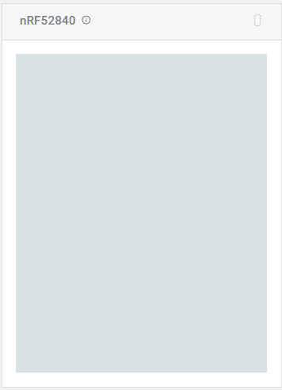

# nrfjprog

`nrfjprog -v`

> nrfjprog version: 10.13.0
> JLinkARM.dll version: 7.50a

* [nrfjprog](#nrfjprog)
  * [Flags and Arguments](#flags-and-arguments)
    * [Information](#information)
    * [Settings](#settings)
    * [Reading and Writing](#reading-and-writing)
    * [Reset](#reset)
    * [CPU actions](#cpu-actions)
  * [Notes](#notes)

## Flags and Arguments

### Information

| flag            | summary                                                         |
| --------------- | --------------------------------------------------------------- |
| -q  --quiet     |                                                                 |
| -v  --version   | nrfjprog installed version                                      |
| --deviceversion | Displays the type of device connected                           |
| --com           | list of the serial port associated with all connected debuggers |
| -i  --ids       | Displays the serial numbers of all the debuggers                |

### Settings

| flag                        | summary                                           |
| --------------------------- | ------------------------------------------------- |
| -s  --snr \<serial_number\> | Selects the debugger with the given serial number |
| -f  --family \<family\>     | NRF51, NRF52, NRF53, NRF91 , UNKNOWN              |
| -c  --clockspeed \<speed\>  | Sets the debugger SWD clock speed in kHz          |
| --log [\<path\>]            | log file                                          |
| --jdll \<file\>             | JLinkARM dll                                      |
| --ini \<file\>              | nrfjprog.ini                                      |
| --qspiini \<file\>          | QspiDefault.ini                                   |

### Reading and Writing

| flag                                                                                                                                     | summary                                                                                                                                                           |
| ---------------------------------------------------------------------------------------------------------------------------------------- | ----------------------------------------------------------------------------------------------------------------------------------------------------------------- |
| --program \<hex_file\> [--sectorerase        \| --chiperase \| --sectoranduicrerase \| --recover] [--qspisectorerase \| --qspichiperase] | Programs the specified image_file into the device. If the target area to program is not erased, the --program operation will fail unless an erase option is given |
| --rbp \<level\>                                                                                                                          | Enables the readback protection mechanism.                                                                                                                        |
| --recover                                                                                                                                | Erases all user available non-volatile memory and disables the read back protection mechanism                                                                     |
| -e  --eraseall                                                                                                                           |                                                                                                                                                                   |
| --eraseuicr                                                                                                                              | Erases the UICR page.                                                                                                                                             |
| --erasepage \<start[-end]\>                                                                                                              | Erases the flash pages starting at the flash page containing the start address and ending at the page containing the end address (not included in the erase)      |
| --qspieraseall                                                                                                                           | Erases all the flash of the external memory device with the help of the QSPI peripheral                                                                           |
| --verify [\<image_file\>] [--fast]                                                                                                       |                                                                                                                                                                   |
| --memwr \<addr\> --val \<val\>                                                                                                           |                                                                                                                                                                   |
| --memrd \<addr\> [--w \<width\>] [--n \<n\>]                                                                                             |                                                                                                                                                                   |
| --ramwr \<addr\> --val \<val\>                                                                                                           |                                                                                                                                                                   |
| --readram \<file\>                                                                                                                       |                                                                                                                                                                   |
| --readcode \<file\>                                                                                                                      |                                                                                                                                                                   |
| --readuicr \<file\>                                                                                                                      |                                                                                                                                                                   |
| --readqspi \<file\>                                                                                                                      |                                                                                                                                                                   |

### Reset

| flag             | summary                                         |
| ---------------- | ----------------------------------------------- |
| --pinresetenable | Enables the pin reset                           |
| -p  --pinreset   | Performs a pin reset                            |
| -r  --reset      | Performs a soft reset                           |
| -d  --debugreset | Performs a soft reset by the use of the CTRL-AP |

### CPU actions

| flag                                      | summary |
| ----------------------------------------- | ------- |
| --halt                                    |         |
| --run [--pc \<pc_addr\> --sp \<sp_addr\>] |
| --coprocessor \<coprocessor\>             |         |

## Notes

| Memory after `nrfjprog -e`   | Memory after `nRF Connect's Programmer` erase                   |
| ---------------------------- | --------------------------------------------------------------- |
|  |  |
